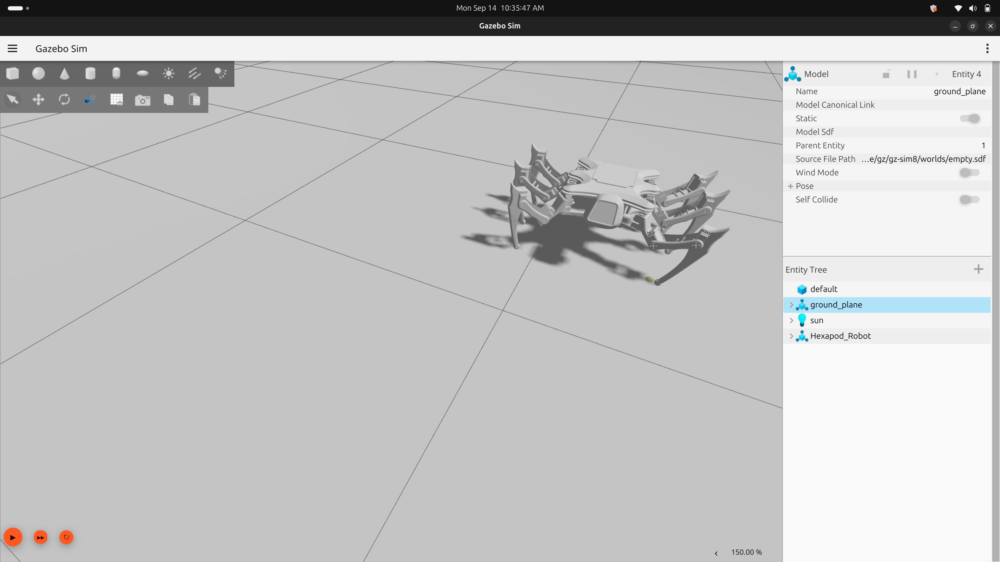
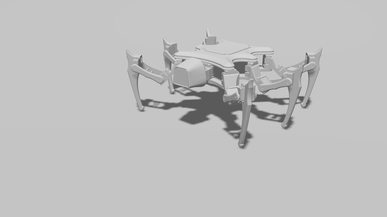
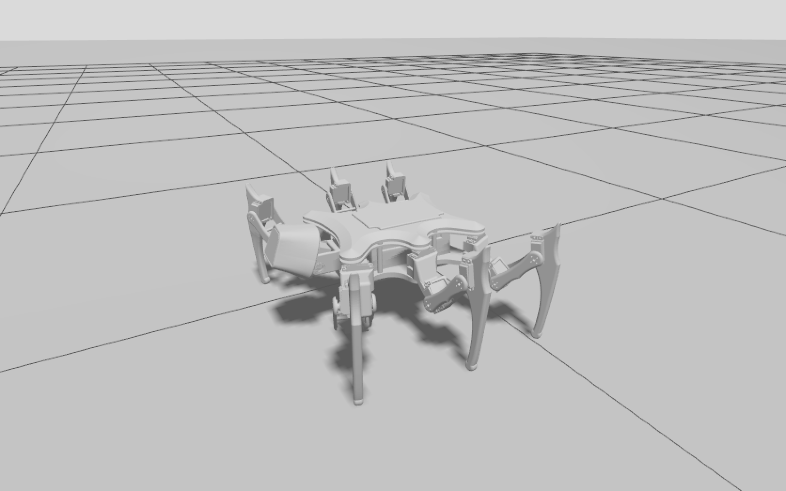
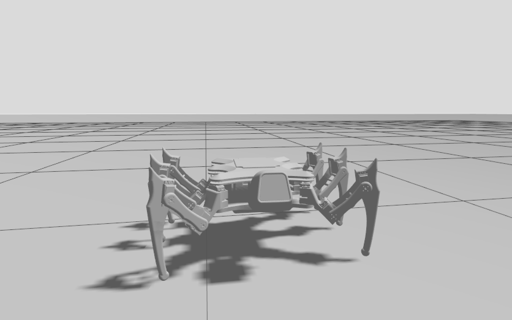
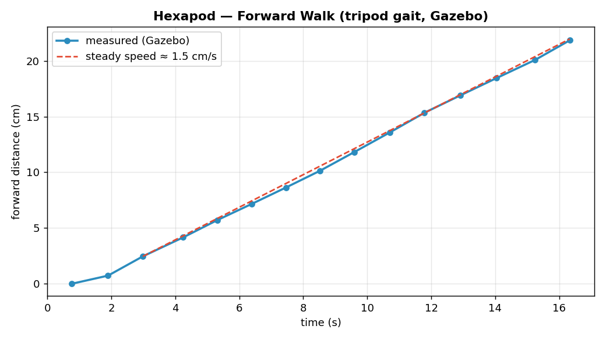

# 🕷️ Hexapod Robot — ROS 2

A six-legged (**hexapod**) walking robot you can run entirely in simulation on
**ROS 2 Jazzy** and **Gazebo Sim**. It stands, balances, and **walks with a
tripod gait**, and you drive it with simple velocity commands — the same way you
would drive any ROS robot.

This project is beginner-friendly: if you have never used ROS 2 before, follow the
steps below top-to-bottom and you will have a walking robot on your screen.

<p align="center">
  <br>
  <em><b>Figure 1.</b> The hexapod standing in Gazebo Sim.</em>
</p>


---

## Table of contents

1. [What is this?](#1-what-is-this)
2. [Demo](#2-demo)
3. [The robot, explained simply](#3-the-robot-explained-simply)
4. [What you need (prerequisites)](#4-what-you-need-prerequisites)
5. [Install](#5-install)
6. [Run it](#6-run-it)
7. [Drive it](#7-drive-it)
8. [How it works](#8-how-it-works)
9. [Project structure](#9-project-structure)
10. [Troubleshooting](#10-troubleshooting)
11. [Roadmap](#11-roadmap)
12. [Toward real hardware](#12-toward-real-hardware)
13. [License](#13-license)

---

## 1. What is this?

A **hexapod** is a robot with **six legs**. Walking on legs (instead of wheels)
lets a robot cross rough ground, but it needs coordination: which legs lift, where
each foot lands, and how the body stays balanced.

This repository contains everything needed to simulate such a robot:

- a **3D model** of the robot (its shape, joints and mass),
- the **control system** that moves its 20 motors,
- a **walking brain** (the *gait*) that turns "go forward" into coordinated leg motion,
- **sensors** — an IMU for orientation, a forward-facing camera on the head, and foot-contact state,
- and **launch files** that start it all with one command.

You run it in **Gazebo**, a physics simulator, so you can develop and test the
robot without owning any hardware. The same software is designed to later drive a
real robot (Raspberry Pi + servos).

**In one line:** type a velocity command, watch a six-legged robot walk.

---

## 2. Demo

<p align="center">
  <br>
  <em><b>Figure 2.</b> Walking forward with the tripod gait, turning left, then
  looking left, right and up with the pan/tilt head (real-time, Gazebo Sim).</em>
</p>

<p align="center">
  
  <br>
  <em><b>Figure 3.</b> The hexapod in Gazebo Sim — angled and front views.</em>
</p>

<p align="center">
  <br>
  <em><b>Figure 4.</b> Forward distance vs. time, measured live from Gazebo —
  a steady walking cruise.</em>
</p>

> 🎥 Re-record the walking GIF any time (with Gazebo, the gait and the head
> running): `python3 demo/record_walk_gif.py`

---

## 3. The robot, explained simply

The robot has **20 motors** (called *joints*):

- **6 legs**, each with **3 joints**:
  - **coxa** — swings the whole leg left/right (like a hip),
  - **femur** — lifts the leg up/down (the thigh),
  - **tibia** — bends the lower leg (the knee).
- a **2-joint "face"** (pan + tilt) at the front, carrying a forward-facing **camera**.

**Sensors:** an **IMU** in the body (orientation, rotation rate, acceleration) and a
**camera** on the pan/tilt head (640×480 @ 30 Hz, 60° field of view). Because the
camera is on the head, panning/tilting the face points the camera. There is no
lidar — vision comes from the camera.

So: 6 legs × 3 joints = 18, plus 2 for the face = **20 joints**.

**Which way is "forward"?** The robot's **front is where the face is** (the −Y
direction in its coordinate frame). When you command "forward", it walks toward
its face — just like you'd expect.

**How it stands.** The legs use a classic, mirror-symmetric hexapod stance: the
middle legs point straight out, and the front and rear legs are splayed 35°
forward and back. The body stands 143 mm high, level, with all six feet on the
ground. Both sides are exact mirror images, which keeps the body stable (the centre
of mass stays well inside every walking tripod). By default the **face looks straight
ahead and level**, so the camera sees what's in front of the robot.

**Joint zero = neutral.** Every coxa angle of 0 means "leg points in its designed
direction", and a face angle of 0/0 means "looking straight ahead". The original
CAD export placed each leg (and the head) at slightly different angles. Those
offsets are folded into the robot model, so angle 0 always means the neutral pose.
The femur/tibia zeros still differ a few degrees between legs (the leg *shapes*
are symmetric); calibrate the real servos accordingly.

**Why "tripod" gait?** The six legs are split into **two groups of three**
(two tripods) that take turns. While one tripod is lifted and swinging forward,
the other three stay planted on the ground. Because three feet are always down,
they form a stable triangle and the robot never tips over. This is the fastest
stable way for a six-legged robot to walk.

---

## 4. What you need (prerequisites)

You need a computer running:

- **Ubuntu 24.04** (Noble)
- **ROS 2 Jazzy** — the robotics framework. Install it by following the official
  guide: <https://docs.ros.org/en/jazzy/Installation.html>
- **Gazebo Sim** + the ROS–Gazebo bridge, and the control packages. Install them
  with one command:

```bash
sudo apt update
sudo apt install -y \
  ros-jazzy-ros-gz \
  ros-jazzy-gz-ros2-control \
  ros-jazzy-ros2-control \
  ros-jazzy-ros2-controllers \
  ros-jazzy-joint-state-publisher-gui \
  ros-jazzy-teleop-twist-keyboard \
  ros-jazzy-xacro \
  ros-jazzy-urdfdom-py \
  python3-pykdl \
  python3-pil \
  python3-colcon-common-extensions
```

What each piece does (so it's not a mystery):

| Package | Why it's needed |
|---------|-----------------|
| `ros-gz` | Connects ROS 2 and Gazebo (the "bridge") |
| `gz-ros2-control` + `ros2-control(lers)` | Runs the motor controllers in the sim |
| `xacro` / `urdfdom-py` | Read and process the robot's 3D model files |
| `python3-pykdl` | Math for the legs (inverse kinematics) |
| `python3-pil` | Saves frames for the demo GIF recorder |
| `colcon-common-extensions` | The tool that builds the project |

---

## 5. Install

A ROS 2 project lives in a **workspace** (a folder with a `src/` inside). Clone
this repo into one and build it:

```bash
# 1. Make a workspace and clone the code into it
mkdir -p ~/hexapod_ros_robot_ws/src
cd ~/hexapod_ros_robot_ws/src
git clone https://github.com/ariegweomamerie/hexapod_ros2.git .

# 2. Build the project (compiles/installs all the packages)
cd ~/hexapod_ros_robot_ws
colcon build

# 3. "Source" the result so ROS can find your packages
source install/setup.bash
```

> **Tip — sourcing:** every new terminal you open must first "source" ROS and this
> workspace, or ROS won't know your commands. Do this at the top of each terminal:
> ```bash
> source /opt/ros/jazzy/setup.bash
> source ~/hexapod_ros_robot_ws/install/setup.bash
> ```

---

## 6. Run it

You'll use a few terminals (each one sourced as above). The repo includes helper
scripts that also fix a common GUI issue on some systems (see Troubleshooting).

**Terminal 1 — start Gazebo (physics + the robot):**
```bash
cd ~/hexapod_ros_robot_ws
./run_gazebo.sh
```
The Gazebo window opens and the robot appears, standing.

**Terminal 2 — start the walking gait:**
```bash
cd ~/hexapod_ros_robot_ws
source /opt/ros/jazzy/setup.bash
source install/setup.bash
ros2 launch hexapod_gait gait.launch.py
```
You'll see `Kinematics ready. Gait running.` — the robot is now ready to walk.

**Terminal 3 — start the head controller** (lets you point the face/camera):
```bash
cd ~/hexapod_ros_robot_ws
source /opt/ros/jazzy/setup.bash
source install/setup.bash
ros2 launch hexapod_head head.launch.py
```
You'll see `Head ready.` followed by the head's angle limits.

**(Optional) Terminal 4 — RViz**, a second viewer useful for debugging:
```bash
cd ~/hexapod_ros_robot_ws
./run_rviz.sh
```
RViz shows the robot model plus a **Face Camera** panel with the live camera feed.

---

## 7. Drive it

Send velocity commands on the `/cmd_vel` topic (standard ROS convention:
`linear.x` = forward, `linear.y` = sideways, `angular.z` = turn):

```bash
# walk forward (toward the face)
ros2 topic pub /cmd_vel geometry_msgs/msg/Twist '{linear: {x: 0.12}}'

# strafe (step sideways)
ros2 topic pub /cmd_vel geometry_msgs/msg/Twist '{linear: {y: 0.10}}'

# turn in place
ros2 topic pub /cmd_vel geometry_msgs/msg/Twist '{angular: {z: 0.4}}'

# stop
ros2 topic pub --once /cmd_vel geometry_msgs/msg/Twist '{}'
```

Prefer the keyboard? Drive it live with the arrow-style keys:
```bash
ros2 run teleop_twist_keyboard teleop_twist_keyboard
```

**See what the robot senses:**
```bash
ros2 topic echo /foot_contacts   # which feet are on the ground (1=down, 0=lifted)
ros2 topic echo /imu             # body orientation, rotation rate, acceleration
ros2 topic hz /face_camera/image # camera stream rate (~30 Hz)
```

**See through the camera** (or use the Face Camera panel in RViz):
```bash
ros2 run rqt_image_view rqt_image_view /face_camera/image
```

**Move the head (pan/tilt):** send `[pan, tilt]` in radians to `/head/cmd`
(needs the head controller from Terminal 3). **`[0, 0]` looks straight ahead.**
Pan ranges −0.38…0.32 (left is positive); tilt ranges −0.42…0.62 (up is
positive, down is negative):
```bash
# look left and slightly down
ros2 topic pub --once /head/cmd std_msgs/msg/Float64MultiArray "{data: [0.25, -0.2]}"

# back to straight ahead
ros2 topic pub --once /head/cmd std_msgs/msg/Float64MultiArray "{data: [0.0, 0.0]}"
```
The head turns smoothly at a limited speed (at most 1 rad/s, set in
`src/hexapod_head/config/head.yaml`). Angles outside the limits are clamped to the
nearest limit, with a warning. A new command smoothly takes over from a move that
hasn't finished yet.

---

## 8. How it works

```text
 you ──/cmd_vel──►  gait node  ──/leg_controller/joint_trajectory──►  controllers ──► Gazebo
 (Twist)            │  - tripod phase clock                                 ▲          (physics)
                    │  - foot trajectory (D-shaped step)                    │
                    │  - inverse kinematics (foot target -> joint angles)   │
                    └──/foot_contacts──►  (which feet are down)             │
                                                                            │
 you ──/head/cmd──► head node  ──/face_controller/joint_trajectory──────────┘
 ([pan, tilt])        - clamps to the URDF limits, speed-limited smooth moves
```

1. **Description** (`Hexapod_Robot_description`) — the robot's 3D model (URDF/xacro):
   links, joints, meshes, foot frames, the simulated **IMU** and **face camera**, and the Gazebo
   control plugin.
2. **Kinematics** — for each leg, given a desired **foot position**, it computes the
   three joint angles that put the foot there (*inverse kinematics*, using KDL).
3. **Gait** (`hexapod_gait`) — the walking brain. It keeps a **tripod clock**; each
   foot follows a **D-shaped path** (a flat push along the ground, then a lifted
   swing forward). It converts those foot paths into joint angles and streams them
   to the controllers ~50 times per second.
4. **Two poses, one footprint** — both poses use the same symmetric stance
   directions at the same 143 mm body height. **Stand** (idle) places the feet
   150 mm from each hip for a wide, stable base. **Walk** pulls them in to 120 mm so
   every leg has room for full strides. Starting or stopping only moves the feet in
   or out — no height change, no twisting.
5. **Head** (`hexapod_head`) — turns a simple "look here" command (`/head/cmd`)
   into a smooth, speed-limited move of the pan/tilt face. It reads the head's
   limits from the robot model, so they always match the URDF.

---

## 9. Project structure

```text
hexapod_ros_robot_ws/
├── src/
│   ├── Hexapod_Robot_description/   # the robot model + simulation setup
│   │   ├── urdf/                    # robot model, ros2_control, Gazebo, IMU, camera, odom
│   │   ├── meshes/                  # 3D shapes for each part
│   │   ├── config/                  # controllers, RViz, ROS–Gazebo bridge
│   │   └── launch/                  # display.launch.py, gazebo.launch.py
│   ├── hexapod_gait/                # the walking brain (Python)
│   │   ├── hexapod_gait/
│   │   │   ├── kinematics.py        # per-leg forward/inverse kinematics
│   │   │   └── gait_node.py         # tripod gait -> joint commands + /foot_contacts
│   │   └── launch/                  # gait.launch.py
│   └── hexapod_head/                # pan/tilt head command interface (Python)
│       ├── hexapod_head/
│       │   ├── motion.py            # clamping + speed-limited move planning (no ROS)
│       │   └── head_node.py         # /head/cmd -> face_controller trajectories
│       ├── config/head.yaml         # max head speed, shortest move
│       ├── launch/                  # head.launch.py
│       └── test/                    # unit tests (colcon test)
├── demo/                            # walk data, plot, GIF recorder
├── docs/
│   ├── ROADMAP.md                   # staged plan + current status and results
│   └── media/                       # images/GIF for this README
├── verification/                    # one acceptance test per roadmap stage
├── run_gazebo.sh                    # start Gazebo (GUI or headless)
├── run_rviz.sh                      # start RViz
└── make_gif.sh                      # turn a video or image frames into a README GIF
```

---

## 10. Troubleshooting

**Gazebo window won't open / crashes with "Failed to create OpenGL context".**
Some machines/remote sessions don't expose modern OpenGL to Gazebo's GUI. Two options:
- Run **headless** (no GUI) and view the robot in RViz instead:
  ```bash
  ./run_gazebo.sh headless:=true      # terminal 1
  ./run_rviz.sh                       # terminal 3
  ```
- Or use software rendering: open `run_gazebo.sh` and uncomment the two
  `LIBGL_ALWAYS_SOFTWARE` / `GALLIUM_DRIVER` lines.

**RViz/Gazebo crash right away with `undefined symbol: __libc_pthread_init`.**
This happens when launching from a VS Code **snap** terminal (it injects snap
libraries). The `run_*.sh` helpers already scrub that; use them instead of calling
`ros2 launch` directly, or launch from a normal terminal.

**`ros2 topic echo` shows nothing / hangs, or a topic seems missing.**
The ROS discovery daemon can go stale. Refresh it:
```bash
ros2 daemon stop && ros2 daemon start
```

**The robot stands but won't walk.** Make sure the gait node (Terminal 2) is
running and prints `Gait running`, and that you're publishing to `/cmd_vel`.

**The head doesn't move.** Make sure the head controller (Terminal 3) is running
and prints `Head ready.`, and that you send exactly two numbers, e.g.
`"{data: [0.2, 0.0]}"`. Its terminal prints a warning when a command is rejected
or clamped.

---

## 11. Roadmap

Development follows a staged **simulation roadmap**, worked **one stage at a time**. Each
stage is verified and approved before the next one starts. The full plan, the current
status and the test results are in **[docs/ROADMAP.md](docs/ROADMAP.md)**.

1. Stable basic gait ← **current stage** (verification: `python3 verification/stage1_basic_gait.py`)
2. SLAM
3. Localization
4. Nav2
5. Navigation tuning
6. Head controller
7. Simulated camera perception
8. Face detection and tracking
9. Object detection
10. Search / look-around behavior
11. Person following
12. Behavior system
13. Dance behavior
14. Interaction (`/dance`, `/wave`, …)
15. Behavior manager
16. Full simulation integration
17. Hardware preparation (only after the simulation is validated)

---

## 12. Toward real hardware

The project is structured so the **same** control stack can drive a physical
robot. The intended build: **Raspberry Pi 4**, an **Adafruit BNO055** IMU, PWM
servo driver(s), **DS3225MG** servos, a display, and a camera. Moving from sim to
real means swapping the Gazebo hardware plugin for a Raspberry-Pi servo driver and
running the BNO055 — the gait, kinematics, and `/cmd_vel` interface stay the same.

> Note: driving all 20 joints needs enough PWM channels; confirm your servo-driver
> channel count matches the number of joints before wiring.

---

## 13. License

Released under the **MIT License** — see [LICENSE](LICENSE). Contributions
(issues and pull requests) are welcome.

Built with [ROS 2](https://www.ros.org/), [Gazebo](https://gazebosim.org/),
[`ros2_control`](https://control.ros.org/), and [Orocos KDL](https://www.orocos.org/kdl.html).
