# Known issues

## 1. The head RGB-D camera renders nothing unless the robot faces a cardinal heading

**Status:** open, blocks Stage 2.3 (RGB-D visual odometry).
**Found:** 2026-09-29, during the Stage 2.3 Run A ring loop.

### What happens

The `face_camera` RGB-D sensor returns **completely empty frames** whenever the
robot's yaw is more than about 10 degrees away from a multiple of 90 degrees:

* colour image: one flat colour, the scene background (RGB 221,225,231), 0 ORB features
* depth image: **100% +infinity**, not zeros - the renderer ran and found no geometry
* the point cloud is empty for the same frames

Within about +/-10 degrees of 0, 90, 180 and 270 degrees the camera is perfect
(95-100% valid depth, 400-1000 ORB features).

Measured standing perfectly still at (7.0, 3.3), 10 degree steps:

| heading | 350 | 0 | 10 | 20..70 | 80 | 90 | 100 | 110..160 | 170 | 180 | 190 | 200..250 | 260 | 270 | 280 | 290..340 |
|---|---|---|---|---|---|---|---|---|---|---|---|---|---|---|---|---|
| blank | 0% | 0% | 0% | 100% | 0% | 0% | 0% | 100% | 0% | 0% | 0% | 100% | 0% | 0% | 0% | 100% |

### What it is not

Each of these was tested and ruled out:

* **not the world** - reproduces identically in the stock `empty.sdf` with only a
  ground plane, and in `hexapod_facility`
* **not the GUI** - identical headless (blank 50-75% while turning either way)
* **not simulator load** - the real-time factor is the same (0.50-0.62) whether
  the frame is blank or good
* **not robot motion** - it reproduces with the robot teleported and standing
  completely still; standing at a cardinal heading is 0% blank, standing at a
  diagonal is 100% blank
* **not the robot's attitude** - body roll and pitch are 0.0 degrees in blank frames
* **not the head joints** - `face_pan`/`face_tilt` hold 0.0000 rad throughout
* **not the TF chain** - `base_footprint -> face_camera_optical_frame` is byte-identical
  in blank and good frames
* **not aiming at empty space** - with a 40x40 m ceiling 5.8 m above and a floor
  6.2 m below the camera (both inside its 12 m range), blank frames still see neither
* **not the sensor type in general** - a standalone `rgbd_camera` spawned into the
  same worlds renders correctly at every yaw, whether spawned rotated or rotated
  at runtime

So the fault is specific to **this sensor as mounted on this robot**. In the
URDF->SDF conversion `face_camera_link` has no inertia, so sdformat lumps it away
and the sensor ends up on `face_link_1` with the baked pose
`0.03247 -0.042942 0.035805  -0.000309 -0.362146 -1.5999`.

### Consequence

RGB-D visual odometry only survives while the robot walks an axis-aligned
heading. Every corner turn blanks the camera for about 2.3 s (35 frames), which
is long enough to lose tracking. In Stage 2.3 Run A the odometry tracked 8.2 m of
the 25.2 m ring with 1.2% drift, then the first corner ended it.

### Fix 1 attempted 2026-09-29: un-lumping the camera link - DID NOT WORK

`face_camera_link` was given a 1 g / 1e-7 kg m^2 inertial and
`face_camera_joint` was given `disableFixedJointLumping` and `preserveFixedJoint`.
The change took effect exactly as intended:

* the SDF gains a 28th link, `face_camera_link`, and keeps `face_camera_joint`
* the sensor moved off `face_link_1` and now sits on `face_camera_link` with an
  identity pose; the joint carries the original transform, so the camera's
  world pose is unchanged (TF translation is still 0.1237, -0.1022, 0.0604)
* Gazebo itself now reports `face_camera_link` as a live link, which it did not before

The camera behaves exactly as it did before: still blank outside roughly +/-15
degrees of a cardinal heading, still colour and depth failing together, still the
same angular extent. Lumping was therefore never the cause.

### Fix 2 attempted 2026-09-30: splitting the sensor - PARTIAL, and very informative

The single `rgbd_camera` was replaced by two sensors on the same link,
`face_camera_rgb` (type `camera`) and `face_camera_depth` (type `depth_camera`),
with identical optics, rate, resolution, clip range and optical frame. Fix 1's
un-lumped link was kept.

**The colour camera is now healthy at every heading. Only depth fails.**

| heading | 0 | 10 | 15 | 18 | 20 | 30 | 45 | 60 | 75 | 90 | 110 | 135 | 180 | 225 | 270 | 315 | 360 |
|---|---|---|---|---|---|---|---|---|---|---|---|---|---|---|---|---|---|
| colour | ok | ok | ok | ok | ok | ok | ok | ok | ok | ok | ok | ok | ok | ok | ok | ok | ok |
| depth | ok | ok | ok | **inf** | **inf** | **inf** | **inf** | **inf** | ok | ok | **inf** | **inf** | ok | **inf** | ok | **inf** | ok |

Colour was flat in **0 frames out of 643**. Depth was 100% infinite in every
frame at 9 of 17 headings. The heading window is unchanged: depth survives to
15 degrees off axis and fails from 18 degrees.

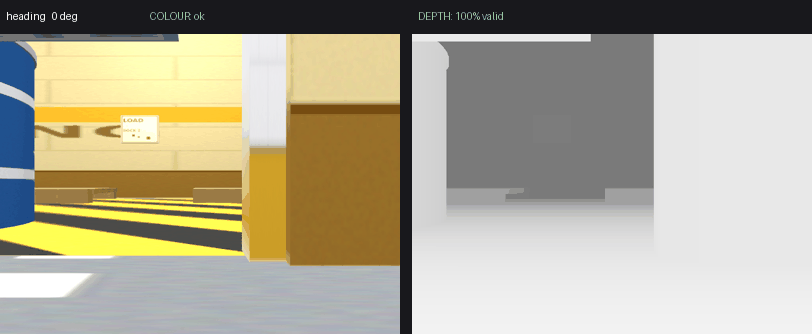

At 45 degrees the colour camera returns a fully lit scene while depth returns
nothing at all:

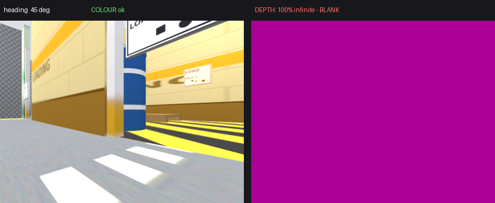

The same `depth_camera` definition in a standalone model, in the same world at
the same moment, works at every heading including 45 degrees:

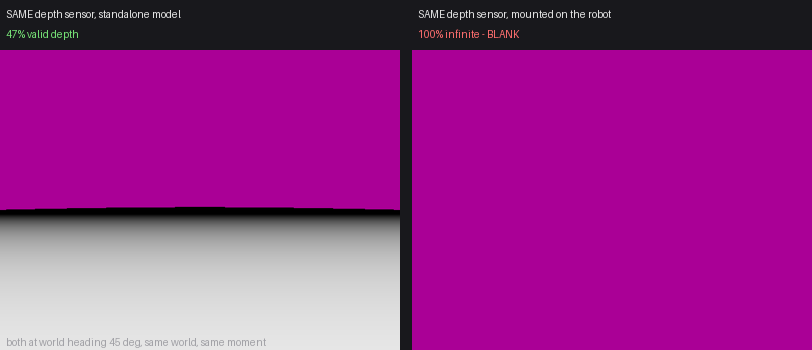

So the defect is **not** the combined RGB-D rendering path, and **not** the
`depth_camera` sensor type. It is the depth camera *as mounted on the robot*:
a depth sensor on an articulated, moving model blanks off-axis, the identical
sensor on a static model does not.

Side effects of the split, to resolve when the sensor design is settled:

* colour and depth stamps stay **identical, 131/131 frames, 0.000 ms** - exact-time
  sync still works, so `rgbd_odometry` needs no parameter change
* `/face_camera/camera_info` is published by both sensors, so it arrives at
  30.3 Hz instead of 15.2 Hz with identical intrinsics from both
* `/face_camera/points` currently has no publisher: the depth camera puts its
  cloud on `/face_camera/depth_image/points`, which is one line of bridge remap
  away, not yet applied

### Fix 3 attempted 2026-09-30: the ogre render engine - MADE IT WORSE

Fix 1 and Fix 2 were left in place and the only variable changed was the render
engine used by the **server** (so the sensors), through a new, default-empty
launch argument:

    ./run_facility.sh render_engine_server:=ogre

Evidence that it took effect: the server process loaded
`libgz-rendering8-ogre.so.8.2.3` and `libOgreMain.so.1.9.0`, with no OgreNext
library mapped at all, and its parent command line ends
`--render-engine-server ogre`.

Startup was clean - robot spawned, all three controllers active, both camera
streams publishing, **zero rendering errors and no crash** in the whole session.

| heading | 0 | 10 | 15 | 18 | 20 | 30 | 45 | 60 | 75 | 90 | 110 | 135 | 180 | 225 | 270 | 315 | 360 |
|---|---|---|---|---|---|---|---|---|---|---|---|---|---|---|---|---|---|
| colour (ogre) | ok | ok | ok | ok | ok | ok | ok | ok | ok | ok | ok | ok | ok | ok | ok | ok | ok |
| depth (ogre2) | ok | ok | ok | inf | inf | inf | inf | inf | ok | ok | inf | inf | ok | inf | ok | inf | ok |
| depth (ogre) | **-inf** | **-inf** | **-inf** | **-inf** | **-inf** | **-inf** | **-inf** | **-inf** | **-inf** | **-inf** | **-inf** | **-inf** | **-inf** | **-inf** | **-inf** | **-inf** | **-inf** |

Colour was flat in 0 of 626 frames and carried 53-837 ORB features. Depth was
invalid in every frame at every heading - and the failure mode itself changed:
under ogre2 blank pixels are `+inf`, under ogre every pixel is **`-inf`**.

So the engine swap **removed the heading dependence by failing everywhere**. This
is outcome D: a different rendering failure, not a fix.

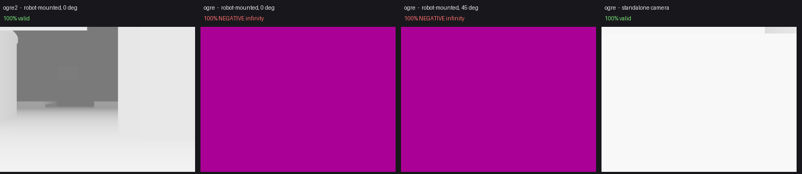

Crucially, under ogre the **standalone** depth camera in the same world still
returns 100% finite depth. So ogre's depth camera is not broken in general -
only the robot-mounted one is, exactly as with ogre2.

Performance was essentially unchanged: RTF 0.61 mean / 0.41 min against the
ogre2 baseline of 0.62, gz server CPU 176% against 172%, GUI 130% against 139%,
GPU 42% against 49%.

**What this rules out:** the defect is not specific to Ogre2 or to
`Ogre2DepthCamera`. Both engines render a standalone depth camera correctly and
both fail on the robot-mounted one. The common factor is the mounting - a depth
sensor on an articulated, moving model - not the engine.

### Static-pose test 2026-09-30: motion is NOT the trigger

Fix 1 and Fix 2 in place, engine back on the default ogre2, nothing else touched.
The gait node was stopped so nothing commanded any joint; the controllers only
held position. The robot was teleported to each heading and left to settle, and
joint and base motion were measured during every collection window, so each row
is verifiably static data:

* joint drift during collection: **1e-18 rad** (numerically zero) at all 17 headings
* base drift: **0.00 mm**, yaw drift below 0.05 degrees
* no rendering errors, no crash

| heading | 0 | 10 | 15 | 18 | 20 | 30 | 45 | 60 | 75 | 90 | 110 | 135 | 180 | 225 | 270 | 315 | 360 |
|---|---|---|---|---|---|---|---|---|---|---|---|---|---|---|---|---|---|
| colour (features) | 497 | 577 | 516 | 681 | 679 | 566 | 938 | 861 | 737 | 630 | 724 | 410 | 784 | 860 | 381 | 163 | 454 |
| depth valid % | 100 | 100 | 100 | **0** | **0** | **0** | **0** | **0** | 97 | 97 | **0** | **0** | 100 | **0** | 98 | **0** | 100 |

Depth produced real data at 8 of 17 headings - the **same** 8 as when the robot
was moving, with the same boundary between 15 and 18 degrees.

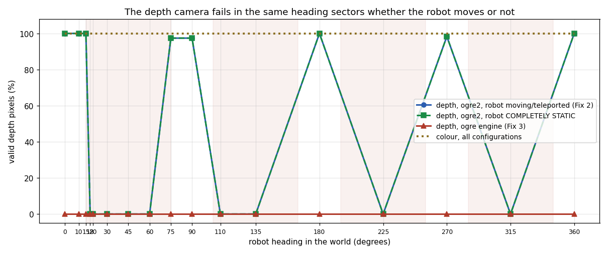

Control test at 45 degrees, base never moving, only `face_pan` nudged to
+0.05 rad and returned to zero:

| window | depth frames | all-infinite | colour flat |
|---|---|---|---|
| static before | 52 | 52 | 0 |
| during pan to +0.05 rad | 26 | 26 | 0 |
| during pan back to 0 | 23 | 23 | 0 |
| static after | 57 | 57 | 0 |

Joint motion changed nothing: depth was 100% infinite throughout, colour was
perfect throughout.

**Verdict: hypothesis 2 - the robot-mounted / model-structure hypothesis.** The
articulated chain and motion are both ruled out. A depth camera attached to this
model fails in fixed world-heading sectors even when the model is perfectly
still, while the same sensor in a standalone model works at every heading.

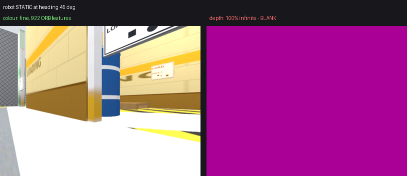

Per-heading stills and an animated sweep: `images/stage2_3/static/`.

### base_link mounting test 2026-09-30: the failure follows the MODEL, not the head chain

Only the depth sensor's parent changed, from `face_camera_link` to `base_link`,
with the measured `base_link -> face_camera_link` transform as a compensating
pose. The colour sensor stayed on `face_camera_link`. Everything else - optics,
rate, resolution, clip range, optical frame, TF tree, engine, world - unchanged.

The physical camera pose was proven identical, not assumed:

| | before | after | delta |
|---|---|---|---|
| TF `base_footprint -> face_camera_optical_frame` translation | 0.123733569, -0.102223325, 0.060389663 | same | **< 5e-10 m** |
| same, rotation quaternion | 0.000062464, -0.707106612, 0.707106944, 0.000063059 | same | **< 5e-10** |
| depth image at 0 deg, pixel against the pre-move reference | - | - | **mean 0.014 mm**, max 1.67 mm |
| depth image at 90 deg, same comparison | - | - | mean 0.036 mm (max 470 mm at one depth edge) |

Runtime confirms the move: Gazebo advertises the sensor as
`Hexapod_Robot::base_footprint::face_camera_depth` while colour stays
`Hexapod_Robot::face_camera_link::face_camera_rgb`. (`base_link` is lumped into
the root link `base_footprint`, and the two frames are coincident, so the
compensating pose carries over exactly.) Exactly one depth sensor exists, no
rendering errors, no crash.

| heading | 0 | 10 | 15 | 18 | 20 | 30 | 45 | 60 | 75 | 90 | 110 | 135 | 180 | 225 | 270 | 315 | 360 |
|---|---|---|---|---|---|---|---|---|---|---|---|---|---|---|---|---|---|
| depth on head chain | 100 | 100 | 100 | **0** | **0** | **0** | **0** | **0** | 97 | 97 | **0** | **0** | 100 | **0** | 98 | **0** | 100 |
| depth on base_link | 100 | 100 | 100 | **0** | **0** | **0** | **0** | **0** | 97 | 97 | **0** | **0** | 100 | **0** | 98 | **0** | 100 |
| colour | ok | ok | ok | ok | ok | ok | ok | ok | ok | ok | ok | ok | ok | ok | ok | ok | ok |

Identical, heading for heading, including the same 15-to-18 degree boundary and
the same finite depth ranges. At 45 degrees the sensor is still 100% invalid,
37 of 37 frames.

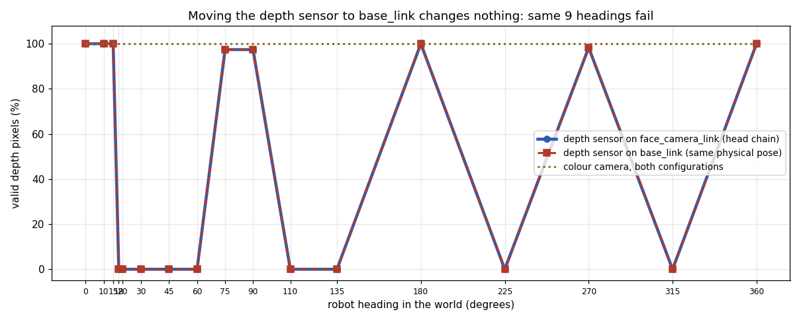
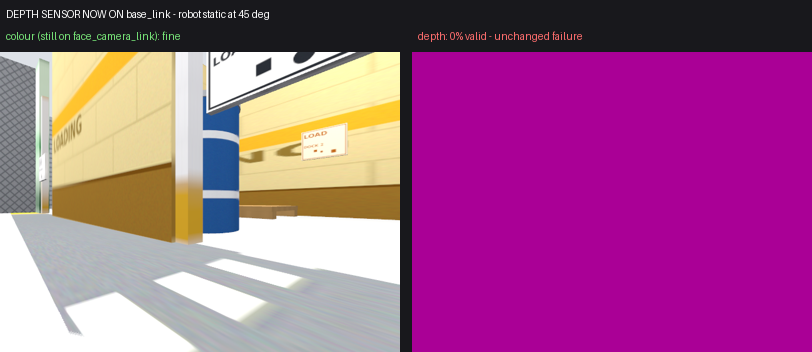

**The failure follows the robot model, not the head chain.** Combined with the
static-pose result, what remains is: a depth camera anywhere on this model fails
in fixed world-heading sectors, while the same sensor on a standalone model does
not, under either render engine, whether or not anything moves.

### Minimal-model test 2026-09-30: a dynamic model is NOT the trigger

The hexapod was first restored to its diagnostic baseline: the `base_link`
mounting reverted, depth back on `face_camera_link`, Fix 1 and Fix 2 kept, ogre2.
Gazebo confirms `Hexapod_Robot::face_camera_link::face_camera_depth`.

Two throwaway models were then spawned into the same running facility world,
sharing nothing with the robot - no meshes, materials, joints, controllers or
plugins:

```
one link: mass 1.0 kg, inertia 0.0042/0.0042/0.0067, a 0.20x0.20x0.15 box
          collision and visual, and one depth_camera:
          640x480, 15 Hz, hfov 1.518 rad, clip 0.10-12 m, R_FLOAT32
```

They differ from each other in exactly one line: `min_dyn` is
`<static>false</static>`, `min_static` is `<static>true</static>`.

Proof the dynamic one really is dynamic:

* it appears in Gazebo's `dynamic_pose/info` stream (344 samples) while
  `min_static` never does (0 samples)
* spawned at z = 0.600 it **fell under gravity** and came to rest at z = 0.0750
* non-zero mass and valid inertia, no joints, no controllers
* during every collection window its position drift was **0.0000 mm**, so the
  results are from a stationary model, not a moving one

| Heading | Static standalone | Minimal DYNAMIC model | Hexapod (same session) |
|---|---|---|---|
| 0 | 99% | 98% | 100% |
| 10 | 49% | 48% | 100% |
| 15 | 99% | 98% | 100% |
| 18 | 99% | 48% | **100% inf** |
| 20 | 99% | 98% | **100% inf** |
| 30 | 50% | 98% | **100% inf** |
| 45 | 50% | 50% | **100% inf** |
| 60 | 50% | 100% | **100% inf** |
| 75 | 100% | 50% | 97% |
| 90 | 50% | 100% | 97% |
| 110 | 100% | 50% | **100% inf** |
| 135 | 99% | 100% | **100% inf** |
| 180 | 45% | 48% | 100% |
| 225 | 47% | 100% | **100% inf** |
| 270 | 50% | 100% | 98% |
| 315 | 49% | 100% | **100% inf** |
| 360 | 99% | 98% | 100% |

Both minimal models produced real depth at **17 of 17** headings, with zero
all-infinite frames anywhere. (Their percentages vary because each camera sees a
different amount of open space past the 12 m clip - that is scene content, not
failure.) The hexapod, in the same world at the same time, failed at the same 9
headings as always. No rendering errors, no crashes, server stable throughout.

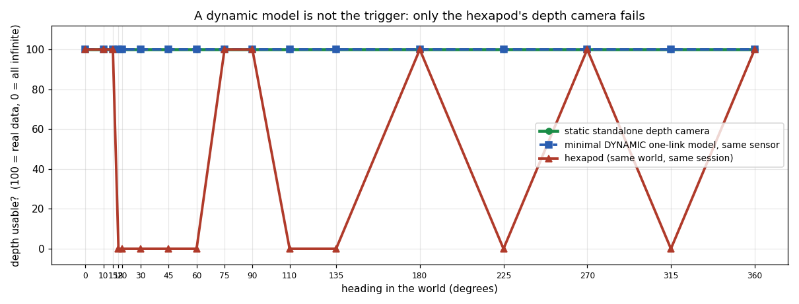

**Conclusion: the defect is specific to the Hexapod Robot model.** Dynamic-model
classification is ruled out, as motion, articulation, mounting link, sensor type
and render engine already were. Something about this particular model - its
scale, its mesh geometry, its link count, its materials, its inertias or its
plugins - makes a depth camera belonging to it fail in fixed world-heading
sectors.

The next step is to add complexity back in controlled increments, from the
minimal model toward the hexapod, and find the smallest difference that
reproduces it. No component should be guessed at before that bisection.

### Bisection step 1, 2026-09-30: hexapod mesh visual geometry - DOES NOT REPRODUCE IT

One controlled change on top of the known-good minimal dynamic model: its box
visual was replaced by a single existing hexapod STL. Nothing else moved - same
one link, same box collision, same inertial, same depth camera, same world,
ogre2.

**Mesh used:** `right_hip_swing_forward_back1_link_1.stl`, the smallest real part
of the robot.

| property | value |
|---|---|
| format | binary STL, 344.8 KB |
| triangles | 7060 |
| vertices | 21180 (3539 unique) |
| bounds | 102.57 x 105.36 x 106.46 mm, i.e. 0.1026 x 0.1054 x 0.1065 m at the URDF scale |
| scale | 0.001 0.001 0.001, exactly as the robot uses it |
| pose | -0.12 0 0.02 in the link, so it sits behind the lens and cannot occlude it |
| disconnected components | **5** |

The mesh was not modified or regenerated, and no other hexapod geometry,
material, joint, controller or plugin was imported.

Structural verification before the sweep: 1 link, 1 collision, 1 visual (the
mesh), 1 depth camera, 0 joints, 0 plugins, not static, camera unchanged at
640x480 / 15 Hz / hfov 1.518 / clip 0.10-12 / R_FLOAT32. Dropped from z = 0.40 it
**fell to rest at z = 0.0750**, confirming it is dynamic, and its position drift
during every collection window was **0.0000 mm**.

The mesh really is in the render scene, not silently missing: parked away and
then placed 0.8 m in front of another depth camera, its silhouette appears in
that camera's depth image.

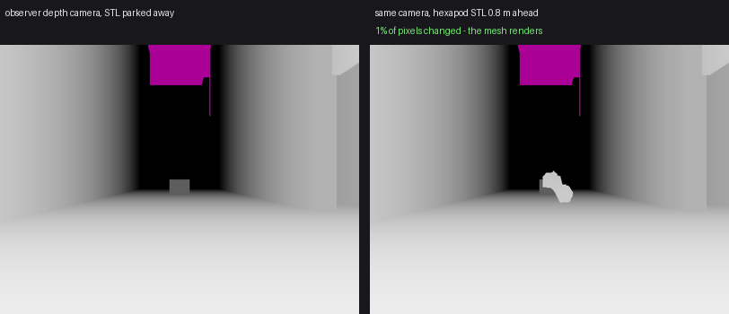

| Heading | Minimal dynamic | Hexapod | Mesh-visual model |
|---|---|---|---|
| 0 | 98% | 100% | 98% |
| 10 | 48% | 100% | 98% |
| 15 | 98% | 100% | 98% |
| 18 | 48% | **100% inf** | 98% |
| 20 | 98% | **100% inf** | 98% |
| 30 | 98% | **100% inf** | 98% |
| 45 | 50% | **100% inf** | 100% |
| 60 | 100% | **100% inf** | 100% |
| 75 | 50% | 97% | 100% |
| 90 | 100% | 97% | 100% |
| 110 | 50% | **100% inf** | 100% |
| 135 | 100% | **100% inf** | 100% |
| 180 | 48% | 100% | 98% |
| 225 | 100% | **100% inf** | 100% |
| 270 | 100% | 98% | 100% |
| 315 | 100% | **100% inf** | 100% |
| 360 | 98% | 100% | 98% |

**17 of 17 headings produced real depth, with zero all-infinite frames.** No
rendering errors, no crashes, server stable.

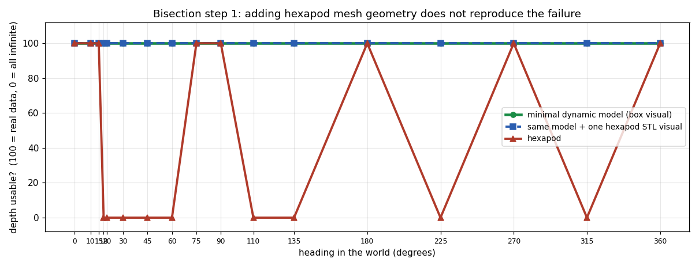

**Conclusion: hexapod mesh visual geometry alone is not sufficient to reproduce
the defect.** Mesh collision was deliberately not added in this step.

### Bisection step 2, 2026-09-30: hexapod mesh collision - DOES NOT REPRODUCE IT EITHER

One controlled addition to the step 1 model: the **same** STL
(`right_hip_swing_forward_back1_link_1.stl`, 7060 triangles, scale 0.001, pose
-0.12 0 0.02) added as a second `<collision>`. The box collision was kept, so the
mesh collision is the only new element. Same link, same inertial, same visual,
same depth camera, same world, ogre2.

Structural verification: 1 link, **2 collisions (1 box + 1 mesh)**, 1 visual,
1 depth camera, 0 joints, 0 controllers, 0 plugins, not static, mass 1.0, camera
unchanged at 640x480 / 15 Hz / hfov 1.518 / clip 0.10-12 / R_FLOAT32. Dropped from
z = 0.40 it settled at z = 0.0750 and drifted **0.0000 mm** during collection.

Gazebo really does use the mesh as a collision, which was checked rather than
assumed. A control model whose *only* collision is that STL was dropped from
z = 0.40 and came to rest at z = -0.0158 and stayed there; had gz ignored the mesh
collision it would have had nothing to stand on and fallen through the floor.
(A box probe dropped onto the mesh slid off to the floor, which is inconclusive
on its own - the part is a bracket with 5 disconnected components and sloped
faces - so the collision-only control is the reliable evidence.)

| Heading | Minimal dynamic | Mesh visual | Mesh visual + mesh collision | Hexapod |
|---|---|---|---|---|
| 0 | 98% | 98% | **98%** | 100% |
| 10 | 48% | 98% | **98%** | 100% |
| 15 | 98% | 98% | **98%** | 100% |
| 18 | 48% | 98% | **98%** | **100% inf** |
| 20 | 98% | 98% | **98%** | **100% inf** |
| 30 | 98% | 98% | **98%** | **100% inf** |
| 45 | 50% | 100% | **100%** | **100% inf** |
| 60 | 100% | 100% | **100%** | **100% inf** |
| 75 | 50% | 100% | **100%** | 97% |
| 90 | 100% | 100% | **100%** | 97% |
| 110 | 50% | 100% | **100%** | **100% inf** |
| 135 | 100% | 100% | **100%** | **100% inf** |
| 180 | 48% | 98% | **98%** | 100% |
| 225 | 100% | 100% | **100%** | **100% inf** |
| 270 | 100% | 100% | **100%** | 98% |
| 315 | 100% | 100% | **100%** | **100% inf** |
| 360 | 98% | 98% | **98%** | 100% |

**17 of 17 headings produced real depth, zero all-infinite frames.** No rendering
errors, no crashes, server stable.

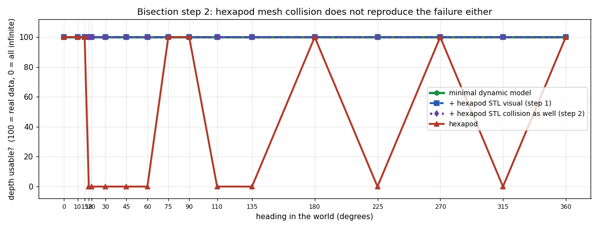

**Conclusion: hexapod mesh collision geometry is also ruled out.** Real robot
mesh geometry, as visual and as collision together, on a dynamic model with the
identical depth camera, renders depth at every heading. The next single increment
is model complexity - many links - not the control plugin.

### Bisection step 3, 2026-09-30: many-link model complexity - DOES NOT REPRODUCE IT

Model structure on its own, with deliberately boring geometry:

| property | value |
|---|---|
| links | **20** (one base + 19 children) |
| joints | **19, all fixed**; zero movable joints |
| visuals | 20, every one a plain box |
| collisions | 20, every one a plain box |
| mesh geometry | **none anywhere** |
| depth cameras | 1, on the base link at pose `0 0 0.075` |
| controllers / ROS plugins / gz_ros2_control | none |
| mass | base 1.0 kg, children 0.2 kg each, all with valid inertia |
| static | no - dynamic, 566 dynamic-pose samples |
| camera | 640x480, 15 Hz, hfov 1.518, clip 0.10-12 m, R_FLOAT32 - identical to steps 1 and 2 |
| world / engine | hexapod_facility / ogre2 |

The 19 child boxes are placed **behind and below the lens** (x from -0.335 to
-0.025 m), so the camera sees only the world, exactly as in steps 1 and 2. All
20 links appear in Gazebo's pose stream, so the whole model loaded.

The first attempt at this sweep was discarded rather than reported: six depth
cameras from earlier experiments were still resident, which starved the frame
rate to 1-2 frames per heading and left 23.8 mm of settling drift. The simulator
was restarted with this model alone, giving 35-39 frames per heading and
**0.0000 mm** drift at every heading.

| Heading | Minimal dynamic | Mesh visual | Mesh visual + mesh collision | Many-link simple model | Actual Hexapod |
|---|---|---|---|---|---|
| 0 | 98% | 98% | 98% | **90%** | 100% |
| 10 | 48% | 98% | 98% | **91%** | 100% |
| 15 | 98% | 98% | 98% | **91%** | 100% |
| 18 | 48% | 98% | 98% | **91%** | **100% inf** |
| 20 | 98% | 98% | 98% | **91%** | **100% inf** |
| 30 | 98% | 98% | 98% | **41%** | **100% inf** |
| 45 | 50% | 100% | 100% | **90%** | **100% inf** |
| 60 | 100% | 100% | 100% | **44%** | **100% inf** |
| 75 | 50% | 100% | 100% | **96%** | 97% |
| 90 | 100% | 100% | 100% | **95%** | 97% |
| 110 | 50% | 100% | 100% | **44%** | **100% inf** |
| 135 | 100% | 100% | 100% | **86%** | **100% inf** |
| 180 | 48% | 98% | 98% | **41%** | 100% |
| 225 | 100% | 100% | 100% | **90%** | **100% inf** |
| 270 | 100% | 100% | 100% | **43%** | 98% |
| 315 | 100% | 100% | 100% | **34%** | **100% inf** |
| 360 | 98% | 98% | 98% | **90%** | 100% |

**17 of 17 headings produced real depth, zero all-infinite frames.** No rendering
errors, no crashes, server stable. The varying percentages are scene content -
how much open space lies past the 12 m clip - not failures.

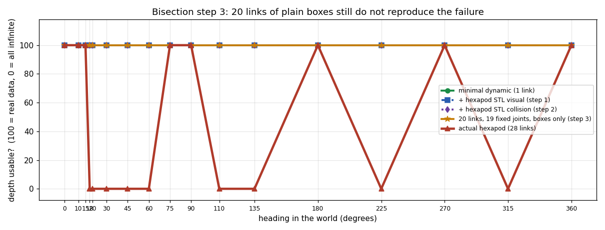

**Conclusion: model structural complexity does not reproduce the defect.** 20
links and 19 fixed joints, a dynamic model of the same size class as the robot,
renders depth at every heading. Link count and fixed-joint structure are ruled
out, as mesh visuals and mesh collisions already were.

### Bisection step 4, 2026-09-30: many links + real meshes - **REPRODUCED**

This is the reproduction case. The step 3 structure (fixed joints only, no
controllers, no plugins, dynamic) with every link carrying **its own real
hexapod STL** as visual and collision, at the pose that link actually has.

| property | value |
|---|---|
| links | **21** (base + 20) |
| joints | **20, all fixed**; movable joints 0 |
| mesh visuals | 21 | 
| mesh collisions | 21 (the robot itself uses the same STL for both, in all 21 links) |
| distinct STLs | **21**, each used once as visual and once as collision |
| scale | `0.001 0.001 0.001` throughout, exactly as the robot defines it |
| meshes modified | none - no simplification, no decimation |
| controllers / ROS plugins / gz_ros2_control / TF publishers | none |
| depth cameras | 1, 640x480, 15 Hz, hfov 1.518, clip 0.10-12 m, R_FLOAT32 |
| dynamic | yes, 406 dynamic-pose samples, settled from a drop |
| stationary | **0.0000 mm** drift at all 17 headings |
| world / engine | hexapod_facility / ogre2 |

Mesh-to-link mapping: 1:1 with the real robot - `base_link.stl` on the base, and
each leg/face link carrying its own STL (`left_hip_swing_forward_back1_link_1`,
`left_tibia_knee1_link_1`, `femur_lift_leg1_link_1`, ... `face_link_1`), with
each link placed at its measured pose relative to `base_link`.

**Deviation to record:** the camera could not stay at step 3's pose
(`0 0 0.075` on the base link) because with the real `base_link.stl` in place
that position is *inside* the body mesh, which would have near-clipped every
frame and made the measurement meaningless. It was placed instead at the pose
the robot's own camera has relative to `base_link`
(`0.123734 -0.102223 0.060390 / -0.000178 0 -1.570797`). All camera *parameters*
are unchanged.

| Heading | Finite depth % | All `+inf`? | Frames | Render errors? | Stable? | Hexapod |
|---|---|---|---|---|---|---|
| 0 | 100% | no | 49 | no | yes (0.0000 mm) | works |
| 10 | 100% | no | 51 | no | yes (0.0000 mm) | works |
| 15 | 100% | no | 51 | no | yes (0.0000 mm) | works |
| 18 | 0% | **YES** | 51 | no | yes (0.0000 mm) | fails |
| 20 | 0% | **YES** | 51 | no | yes (0.0000 mm) | fails |
| 30 | 0% | **YES** | 50 | no | yes (0.0000 mm) | fails |
| 45 | 0% | **YES** | 50 | no | yes (0.0000 mm) | fails |
| 60 | 0% | **YES** | 51 | no | yes (0.0000 mm) | fails |
| 75 | 97% | no | 50 | no | yes (0.0000 mm) | works |
| 90 | 97% | no | 51 | no | yes (0.0000 mm) | works |
| 110 | 0% | **YES** | 51 | no | yes (0.0000 mm) | fails |
| 135 | 0% | **YES** | 51 | no | yes (0.0000 mm) | fails |
| 180 | 100% | no | 50 | no | yes (0.0000 mm) | works |
| 225 | 0% | **YES** | 51 | no | yes (0.0000 mm) | fails |
| 270 | 98% | no | 50 | no | yes (0.0000 mm) | works |
| 315 | 0% | **YES** | 50 | no | yes (0.0000 mm) | fails |
| 360 | 100% | no | 50 | no | yes (0.0000 mm) | works |

**17 of 17 headings agree with the real hexapod**, including the nine failing
ones: 18, 20, 30, 45, 60, 110, 135, 225, 315. The failure is total at those
headings - every frame all-infinite, 50-51 frames each - and the working
headings return healthy 0.27-7.92 m depth. No rendering errors, no crashes,
server stable, model motionless throughout.

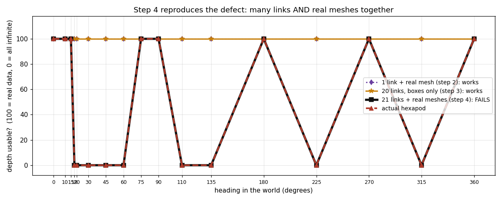
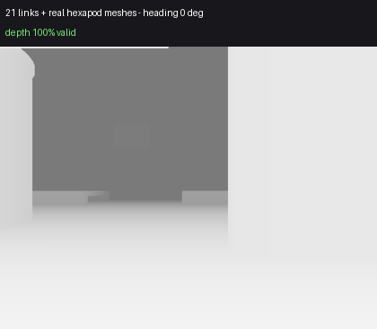

**Conclusion: many links AND real mesh geometry together reproduce the defect;
neither alone does.** A model with no ROS software of any kind - no controllers,
no plugins, no gait, no TF - fails exactly where the robot fails. This is now a
minimal, self-contained reproduction case suitable for an upstream bug report.

**Caveat to settle next:** step 4 changed two things against step 3, the meshes
*and* the camera's position within the model (forced by the body mesh, above).
A control that moves this model's camera clear of its own geometry, or gives the
step 3 box model the same camera pose, would separate "many links + meshes" from
"camera embedded among the model's own mesh geometry".

### Bisection step 5, 2026-09-30: camera placement - **THE FAILURE DISAPPEARS**

The step 4 reproduction model with exactly one thing changed. A line-by-line
diff of the two SDF files shows three differing lines: the model name, the topic
name, and the camera's origin. All 21 links, all 21 STL visuals, all 21 STL
collisions, the mesh-to-link mapping, scales, poses, masses, inertias, world,
engine and every camera parameter are byte-identical.

| | step 4 | step 5 |
|---|---|---|
| camera origin in the model | `0.123734 -0.102223 0.060390` | `0.123734 -0.442223 0.060390` |
| orientation | `-0.000178 0 -1.570797` | **identical** |
| resolution / rate / FOV / clip / format | 640x480 / 15 Hz / 1.518 / 0.10-12 / R_FLOAT32 | **identical** |

The model's whole-mesh envelope, computed from all 21 STLs at their real poses,
is x -0.1973..0.4273, y -0.1406..0.3677, z -0.1301..0.1148 m. The step 4 camera
origin sits **inside** that envelope. The step 5 origin was moved 0.340 m along
the camera's own view axis, which leaves it **0.302 m outside** the envelope with
the near-clip volume pointing further away still, and its view of the world
unobstructed by the model.

| Heading | Step 4 (camera inside the meshes) | Step 5 (camera moved clear) | Changed? |
|---|---|---|---|
| 0 | 100% | 100% | no |
| 10 | 100% | 100% | no |
| 15 | 100% | 100% | no |
| 18 | **100% inf** | 100% | **FIXED** |
| 20 | **100% inf** | 100% | **FIXED** |
| 30 | **100% inf** | 100% | **FIXED** |
| 45 | **100% inf** | 100% | **FIXED** |
| 60 | **100% inf** | 99% | **FIXED** |
| 75 | 97% | 98% | no |
| 90 | 97% | 98% | no |
| 110 | **100% inf** | 98% | **FIXED** |
| 135 | **100% inf** | 100% | **FIXED** |
| 180 | 100% | 100% | no |
| 225 | **100% inf** | 100% | **FIXED** |
| 270 | 98% | 99% | no |
| 315 | **100% inf** | 100% | **FIXED** |
| 360 | 100% | 100% | no |

**All nine failing headings became valid; nothing that worked broke.** 52-54
frames per heading, 0.0000 mm drift, no rendering errors, no crashes.

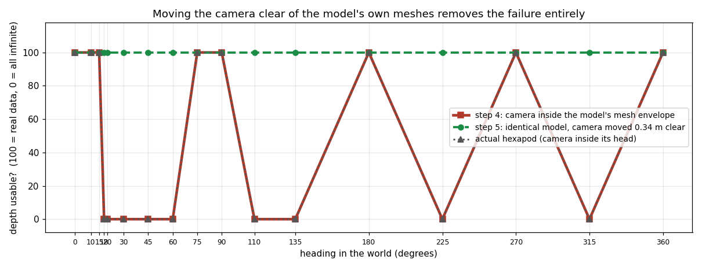
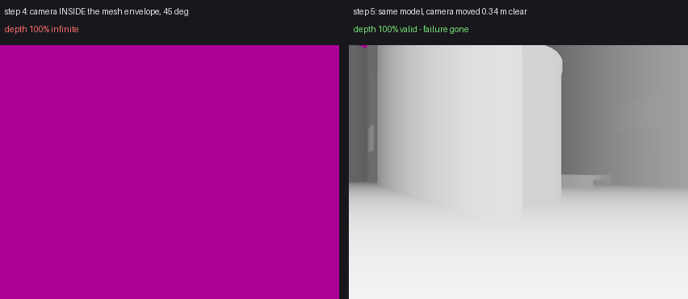

**Conclusion: camera placement is a required factor.** The minimal reproduction
condition is not "many links + real meshes" on its own - it is **a depth camera
whose origin sits inside the model's own mesh geometry**, on a multi-link model
with real meshes. Move the same camera clear of that geometry and the defect
vanishes completely.

This matches the real robot exactly: its camera sits at the face, surrounded by
`face_link_1.stl` and the body, i.e. inside its own mesh envelope.

**It also suggests a practical workaround for Stage 2.3**, not yet tested on the
real robot: move the head camera far enough forward that no robot mesh lies
within its near-clip volume. That is a robot-description change and needs a
decision before it is applied.

### Step 6, 2026-09-30: relocating the REAL robot's camera - **THE ROBOT IS FIXED**

The hypothesis from step 5 applied to the actual hexapod. One variable changed:
the origin of `face_camera_joint` in the robot's xacro. No change to geometry,
STLs, scales, mesh poses, joints, controllers, ros2_control, gz_ros2_control,
gait, TF structure, camera parameters, camera orientation, world, renderer,
physics or any SLAM configuration.

Measured first, then moved: transforming all 717,096 mesh vertices into the
camera frame showed the lens sitting **38.4 mm inside `face_link_1`**, the face
shell, which is the only link with geometry ahead of it.

| | value |
|---|---|
| original joint origin | `xyz 0.032470 -0.042942 0.035805` |
| new joint origin | `xyz 0.030837 -0.099027 0.057062` |
| translation | **60 mm along the camera's own view axis**, clearing the shell by 21.6 mm |
| orientation | `rpy -0.000309 -0.362146 -1.599897`, **unchanged** |
| parent link | `face_link_1`, unchanged |

TF after the move: `base_footprint -> base_link -> face_bracet_base_link_1 ->
face_link_1 -> face_camera_link -> face_camera_optical_frame`, intact. The
optical frame moved exactly **60.0 mm** along the view direction, from
(0.123734, -0.102223, 0.060390) to (0.123733, -0.162224, 0.060390), and its
orientation changed by **4.2e-10**, i.e. not at all. REP-145 axes still correct.

| Heading | Original camera | Relocated camera | Fixed? |
|---|---|---|---|
| 0 | 100% | 100% | - |
| 10 | 100% | 100% | - |
| 15 | 100% | 100% | - |
| 18 | **100% inf** | 100% | **YES** |
| 20 | **100% inf** | 100% | **YES** |
| 30 | **100% inf** | 100% | **YES** |
| 45 | **100% inf** | 100% | **YES** |
| 60 | **100% inf** | 98% | **YES** |
| 75 | 97% | 98% | - |
| 90 | 97% | 97% | - |
| 110 | **100% inf** | 98% | **YES** |
| 135 | **100% inf** | 100% | **YES** |
| 180 | 100% | 100% | - |
| 225 | **100% inf** | 100% | **YES** |
| 270 | 98% | 98% | - |
| 315 | **100% inf** | 100% | **YES** |
| 360 | 100% | 100% | - |

**All nine failing headings fixed, zero regressions, 30-38 frames each, robot
static to 3e-18 rad, no rendering errors, no crashes.**

Post-relocation verification: colour 15.15 Hz 640x480 rgb8; depth 15.15 Hz
640x480 32FC1, 0.29-8.86 m, 96% valid; intrinsics unchanged (fx = fy = 337.36,
cx 320, cy 240, 87.0 x 70.9 deg); **stamps identical on 128/129 frames** (the
odd one is the last colour frame of the window, no depth partner yet).

Still outstanding from Fix 2, unchanged by this step: `/face_camera/camera_info`
has two publishers so it arrives at 30.4 Hz, and `/face_camera/points` has no
publisher because the depth camera puts its cloud on
`/face_camera/depth_image/points`.

#### The ring loop that previously died at the first corner now completes

Same route, same gait, same untouched `rgbd_odometry` configuration, bag recorded:

| | Run A, before | after relocation |
|---|---|---|
| ground-truth path | 25.19 m | 25.19 m |
| **distance tracked** | **8.26 m, then lost** | **25.19 m, the whole loop** |
| lost frames | 1265 (65% of the run) | **0** |
| registration failures | many, never recovered | **0 in 3461 frames** |
| ATE (RMSE) | 0.058 m over 8 m | 0.146 m over 25 m |
| final position error | 0.102 m at the point of failure | **0.231 m after a full loop** |
| drift per metre | 1.2% | **0.9%** |
| final yaw error | 3.31 deg | **0.05 deg** |
| max yaw error | 4.15 deg | 2.90 deg |
| odometry rate | 13.3 Hz | 14.0 Hz |
| RTF / CPU / GPU | 0.44 / rgbd 60% / 49% | 0.47 / rgbd 53% / 25% |

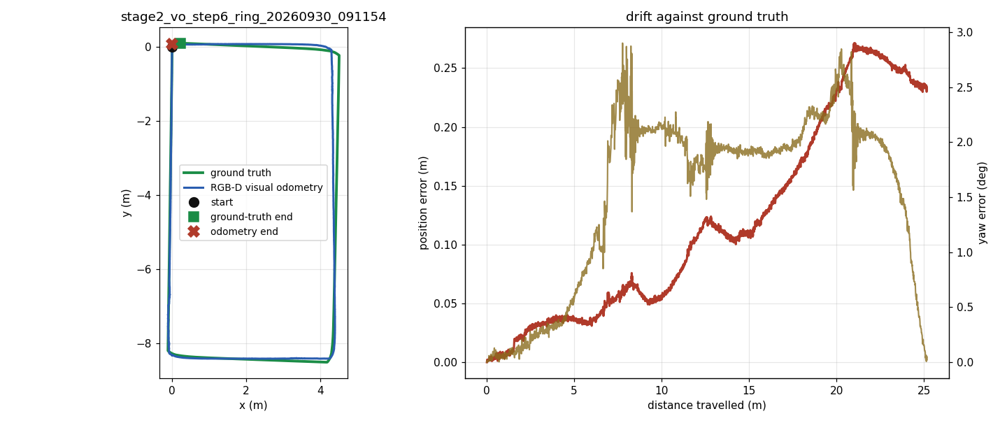

Open-loop drift improved as well as the tracking: 0.9% per metre sustained over
the full 25 m, with the odometry returning to within 0.23 m of START and its
heading within 0.05 degrees. Stage 2.3 is unblocked.

### Step 7, 2026-09-30: the frozen Stage 2.3 configuration

Cleanup of the two side effects, then a clean-session verification of the whole
stack. No performance tuning, no change to the camera relocation.

**Duplicate `camera_info`.** Gazebo derives a sensor's `camera_info` topic from
its image topic by replacing the last component, so `face_camera/image` and
`face_camera/depth_image` both resolved to `/face_camera/camera_info` and the
intrinsics were published twice (30.4 Hz instead of 15.2). `<camera_info_topic>`
does not help - the plain camera sensor honours it, `DepthCameraSensor` ignores
it - so the depth sensor was given its own Gazebo namespace,
`face_camera_depth/image`, and the bridge maps it back to the unchanged ROS
name. Result: one publisher, 15.15 Hz.

**Point cloud.** The depth sensor names its cloud after its own image topic. The
bridge now maps `/face_camera_depth/image/points` to the documented ROS name
`/face_camera/points`; no duplicate cloud was created. It carries `xyz` plus an
`rgb` field holding the depth sensor's greyscale intensity (r = g = b), not the
colour camera's image - the old combined `rgbd_camera` gave true colour there.
Nothing in Stage 2.3 consumes the cloud, so this is recorded rather than
worked around.

| Gazebo topic | ROS topic |
|---|---|
| `/face_camera/image` | `/face_camera/image` |
| `/face_camera/camera_info` | `/face_camera/camera_info` |
| `/face_camera_depth/image` | `/face_camera/depth_image` |
| `/face_camera_depth/image/points` | `/face_camera/points` |
| `/face_camera_depth/camera_info` | not bridged (duplicate intrinsics) |

**What is kept, and why**

| change | status |
|---|---|
| Camera relocated 60 mm forward | **required** - this is the fix |
| Fix 2, colour and depth as separate sensors | **required** - with one `rgbd_camera` the colour stream fails too |
| Fix 1, un-lumped `face_camera_link` with an inertial | **recommended**, not required: it did not fix anything, but it makes the camera a real link that Gazebo reports and keeps the sensor's pose independent of lumping |
| `render_engine_server` launch argument | **optional, no-op by default**: empty leaves the command line untouched. Kept as a diagnostic handle |
| Depth sensor's own Gazebo namespace | **required** for a single `camera_info` publisher |

**Clean-session verification**

| check | result |
|---|---|
| colour | 15.15 Hz, 640x480 `rgb8`, `face_camera_optical_frame` |
| depth | 15.15 Hz, 640x480 `32FC1`, 0.29-8.86 m |
| camera_info | 15.15 Hz, **1 publisher**, fx = fy = 337.36, 87.0 x 70.9 deg |
| point cloud | 15.15 Hz, organised 640x480 on `/face_camera/points`, 1 publisher |
| colour/depth stamps | **99/99 identical** |
| TF | `base_footprint -> face_camera_optical_frame` at (0.123733, -0.162224, 0.060390); `odom -> base_footprint` owned by visual odometry |
| visual odometry | continuous, 13.3 Hz |
| depth at 0, 18, 45, 90, 135, 225, 315 deg | **0 all-infinite frames**, 97-100% valid, `/odom` flowing throughout |

### Runs B and C, 2026-09-30: repeatability on the frozen configuration

Two ring loops on the Step 7 configuration, nothing changed between them - same
camera pose and parameters, same Gazebo namespaces and bridge mappings, same TF,
same `rgbd_odometry` parameters, same gait, same velocity, same world, same
renderer, same physics.

| Metric | Baseline (step 6) | Run B | Run C |
|---|---|---|---|
| Path length (ground truth) | 25.19 m | 25.19 m | 25.19 m |
| Distance tracked | 25.19 m | **25.19 m** | **20.94 m** |
| Lost frames | 0 | **0** | **304 (15%)** |
| Visual odometry rate | 14.0 Hz | 13.0 Hz | 13.4 Hz |
| ATE (RMSE) | 0.146 m | 0.394 m | 0.183 m |
| Drift per metre | 0.9% | 2.6% | 2.1% |
| Final position error | 0.231 m | 0.667 m | 0.442 m |
| Final yaw error | 0.05 deg | 2.53 deg | 3.59 deg |
| Loop completed by the robot | yes | yes | yes |
| All-infinite depth frames | 0 | **0** | **0** |
| Rendering errors / crashes | none | none | none |
| Robot stable | yes | yes | yes |

Bags: `verification/runs/stage2_vo_runB_20260930_103353/bag` and
`.../stage2_vo_runC_20260930_104125/bag`, both scored with `score_bag`.

**The camera defect did not return.** Depth was valid in every frame of both
runs, at every heading, including all four corners. That is the result these
runs were built to check, and it held.

**Run C lost visual tracking at 20.96 m**, at (3.47, 7.74) facing -63 degrees -
the north-west corner - and this is a different failure with a different cause:

| | old depth defect | Run C |
|---|---|---|
| depth | 100% infinite | **100% valid**, 0.29-1.02 m |
| colour | flat background, 0 features | a real image |
| ORB features | 0 because nothing rendered | 20, then 24, then **0**, then 194 |

The camera was 0.68 m from a plain block wall with a dark kick plate and a
blown-out white floor - a genuinely featureless view - so feature matching ran
out of material for about a second while the robot turned.

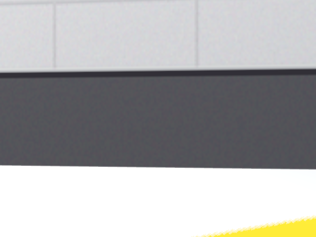

Two honest conclusions:

1. **Tracking through corners is repeatable in the sense that mattered:** the
   rendering defect is gone, and both runs drove the full ring with valid depth
   throughout.
2. **Open-loop accuracy is not tightly repeatable**, and pure frame-to-frame
   odometry is fragile at one texture-poor corner. Drift per metre ranged 0.9%
   to 2.6% across three runs of the identical route. Nothing was tuned between
   runs, and nothing should be read into the ordering.

The facility's own validation reported 343-1476 ORB features at 18 sampled
viewpoints, but those were sampled standing in open space; this corner, seen
from 0.68 m while turning, is below that floor. Worth revisiting when the world
is next touched - not now.

### Remaining candidate fixes (not applied)

1. Run the sensors system on the `ogre` render engine instead of `ogre2`.
3. Update gz-sim/gz-rendering beyond Jazzy's 8.15 in case it is fixed upstream.

### Related fragility seen in the same build

Spawning and removing `rgbd_camera` models at runtime segfaults the server in
`Ogre2DepthCamera::Render()` -> `CompositorPassQuad::execute` ->
`HlmsDatablock::_unlinkRenderable`. Three RGB-D robots in one world also
segfaulted on load. Avoid runtime spawn/remove of RGB-D sensors on this build.

### Evidence

* `verification/runs/stage2_vo_runA_ring_20260929_204830/` - the run, its bag and plots
* `.../failure/` - the frames either side of the loss: 986, 947, 712, 475 features,
  then 0

---

## 2. The ring's NW corner gave the camera nothing to look at

**Status: fixed 2026-09-30 by one visual-only decal. Root cause understood.**

### What happened

Through Stage 2.4 the visual odometry kept failing at one place: about 21 m
into the 25.19 m ring, at the corridor's north-west corner (world `3.30, 7.70`).
Three runs died or stumbled there and nowhere else - 20.96 m, 20.98 m, 21.03 m.
Two parameter experiments (`Vis/PnPVarianceMedianRatio`, `Odom/ResetCountdown`)
moved the symptom around without removing it.

### Why: a 6 cm camera and a flat kick plate

The face camera sits **0.060 m** above `base_footprint`, measured, not assumed:

```
$ ros2 run tf2_ros tf2_echo base_footprint face_camera_optical_frame
- Translation: [0.124, -0.162, 0.060]
```

`textures.py` was written for a camera at 0.14 m. At 0.060 m, with an 87 deg
field of view, a wall 0.35 m away fills the frame from the floor to 0.31 m up -
and the bottom 0.39 m of every `plant_wall` texture is a **solid kick plate with
no detail in it**. Walking west along the north leg, the robot drives straight
at the west wall, and the last 0.6 m of that approach is a single flat grey.

Measured through a probe camera with the robot's exact intrinsics, height and
forward offset, ORB keypoints at each ring corner on the final approach:

| corner | approach 0.4 m | 0.2 m | at the corner | turning 15 deg |
|--------|---------------:|------:|--------------:|---------------:|
| SW     | 417 | 385 | 398 | 475 |
| SE     | 522 | 157 |  15 |  39 |
| NE     | 603 | 503 | 515 | 811 |
| **NW** | **18** | **0** | **0** | **0** |

Not "few features" - **zero**. The NW corner is the only one where this
happens, because the wall there wears `wall_parts`, the one `plant_wall` in the
facility with neither an accent band nor a label, so below 0.4 m it is one flat
tone. Every other corner has a doorframe, a pillar, a handrail or a fence mesh
inside the camera's 0.5 m cone.

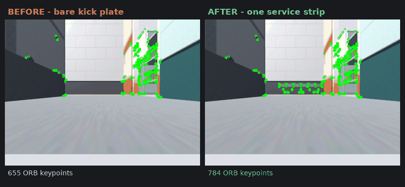

*The same approach, before and after, ORB keypoints drawn on. Left: the frame
fills with kick plate and the detector finds nothing.*

The full sweep, frame by frame with the count on each - the last stretch of the
north leg, the corner turn, then away down the west leg:

| before | after |
|---|---|
| 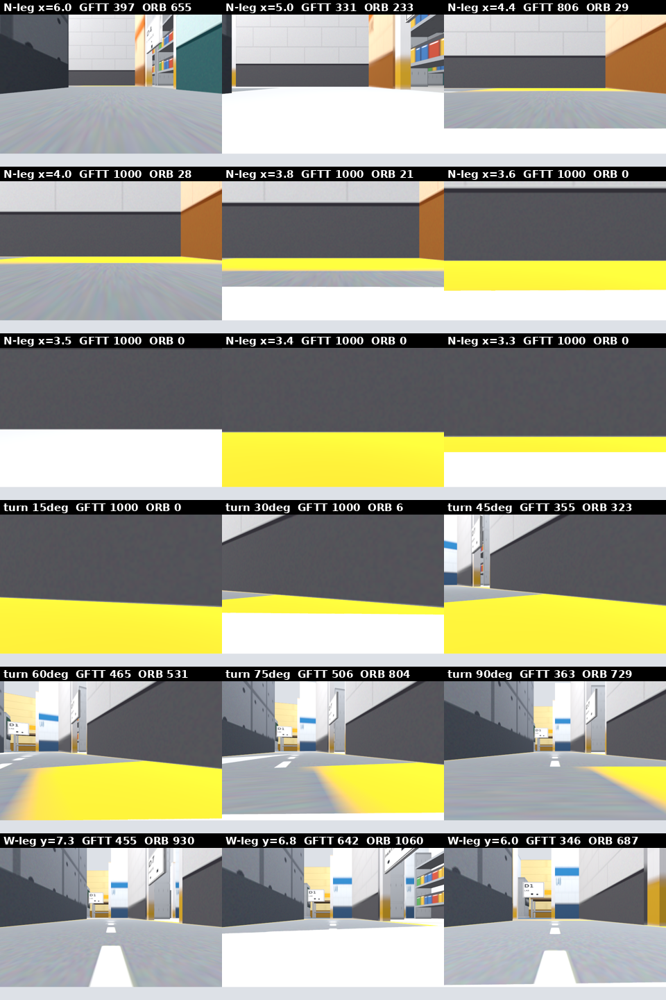 | 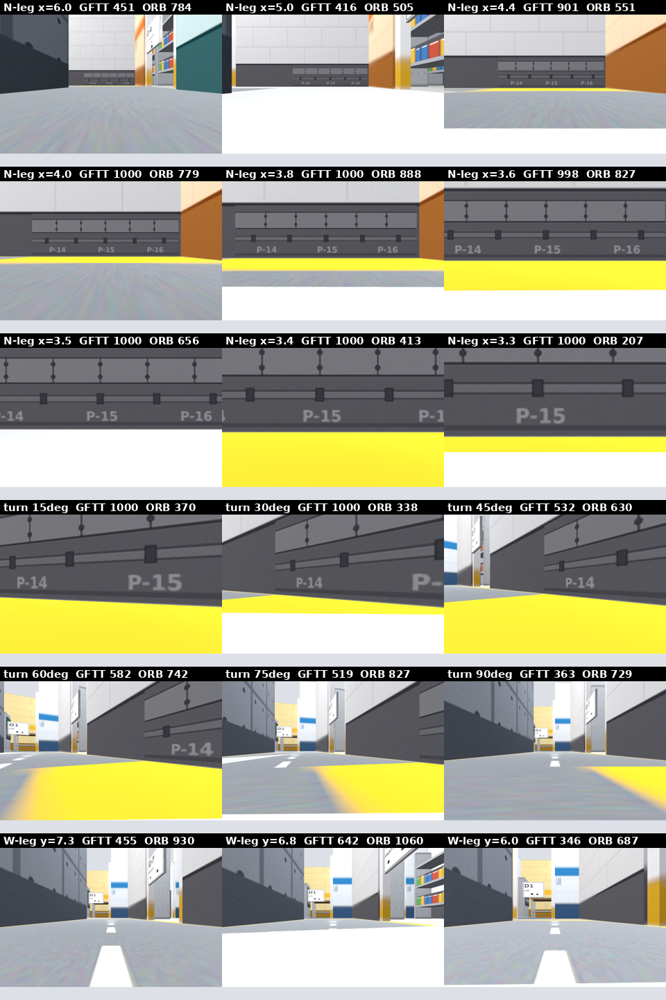 |

### The fix: one visual-only decal, 1.30 m of wall

A `kick_service_strip` texture - trunking lid, bolt pairs, conduit clips and
stencilled panel codes `P-14/15/16`, all within about 45 grey levels of the kick
plate it sits on, so it is quiet to the eye but every element is a hard step
edge. It is laid on the existing west wall face as a 10 mm plate at
`x = 2.680, y = 7.65, z = 0.20`, spanning 1.30 m x 0.36 m: exactly the band the
camera stares into.

It is declared in `layout.DECALS` and emitted by `generate.py` with
`collide=False`, so it is **geometrically invisible to the robot**:

```
collision elements before: 95   after: 95
identical collision set: True
added: none  removed: none
```

The regenerated world differs from the previous one by exactly one `<visual>`
element and nothing else.

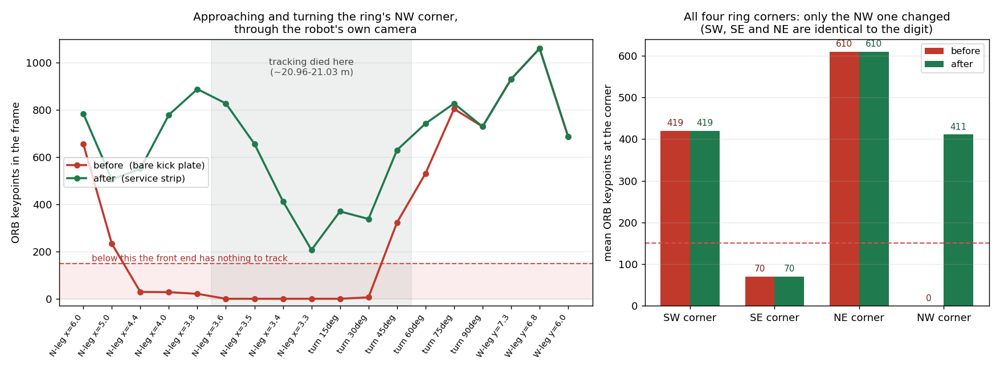

Localisation of the change is measured, not asserted: every probe reading at
the SW, SE and NE corners is **identical to the digit** before and after. Only
the NW corner moved, from 0-18 keypoints to 207-909.

### The ring that followed

One run, `Vis/PnPVarianceMedianRatio: 2`, `Odom/ResetCountdown: 0`,
`Vis/MinInliers: 20`, `RGBD/OptimizeMaxError: 3.0`, all four verified on the
live nodes before driving, fresh database, no screen recorder:

| | clean baseline | ratio 2 | ratio 2 + reset | **+ NW strip** |
|---|---:|---:|---:|---:|
| `Vis/PnPVarianceMedianRatio` | 4 | 2 | 2 | 2 |
| `Odom/ResetCountdown` | 0 | 0 | 1 | 0 |
| ground-truth path (m) | 25.23 | 25.23 | 25.23 | 25.19 |
| odometry path (m) | 26.29 | 22.96 | 25.62 | **25.44** |
| ATE RMSE (m) | 0.774 | 1.827 | 0.343 | **0.276** |
| final position error (m) | 1.242 | 3.028 | 1.148 | **0.537** |
| drift per metre | 4.92% | 12.00% | 4.55% | **2.13%** |
| final yaw error (deg) | 7.55 | 7.41 | 17.23 | **2.19** |
| lost frames | 0 | 272 | 2 | **0** |
| first loss | none | 20.98 m | 21.03 m | **none** |
| worst frame, features | 76 | 84 | - | **136** |
| worst frame, inliers | 25 | 0 | - | **35** |
| SLAM final position error (m) | - | - | 9.351 | **0.560** |
| SLAM final yaw error (deg) | - | - | 179.95 | **2.17** |

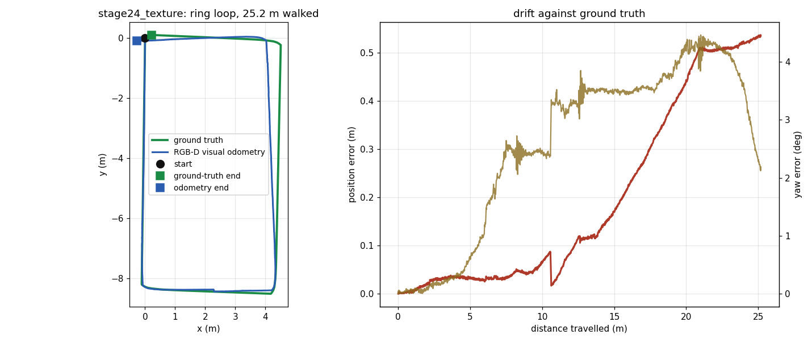

Odometry confidence per leg, from `/odom`'s own covariance in the bag:

| leg | texture run: null frames | std dev mean | ratio-2 run: null frames |
|---|---:|---:|---:|
| 0-8.4 m south | 0 | 11.70 mm | 0 |
| 8.4-12.8 m east | 0 | 8.81 mm | 0 |
| 12.8-20 m north | 0 | 18.33 mm | 0 |
| **20-21.6 m NW corner** | **0** | **7.53 mm** | 45 of 105 |
| 21.6-25.2 m west | 0 | 17.24 mm | **216 of 216 - never recovered** |

The corner that used to kill the odometry is now the **most confident stretch of
the whole ring**: a close, well-lit, high-contrast target at a known range is
about the best thing a PnP front end can be given.

### What this run also settled: there is no loop-closure problem

Every rejected candidate in the run was placed on the ground-truth ring by
timestamp and checked against where the robot actually was:

```
inlier-rejected candidates : 55  ->  genuine same-place: 0,  look-alikes: 55
graph-rejected candidates  : 21  ->  genuine same-place: 0,  look-alikes: 21
return-to-START candidates :  0
```

Every one is a pair 4.6-9.5 m apart with the robot facing **~180 deg opposite** -
the south leg matched against the north leg. Those are the corridor look-alikes
this facility was deliberately built to contain (`layout.py`: *"the two long
corridor legs share, on purpose"*). RTAB-Map rejecting them is correct
behaviour, and `RGBD/OptimizeMaxError = 3.0` is doing its job. **It must not be
lowered.**

The two closures RTAB-Map *did* accept are genuine: nodes 148 and 149 (14.6 and
14.8 m into the ring) back to node 138 (12.75 m) - looking back at the NE corner
after turning it. They are the first real loop closures accepted in any Stage
2.4 run, and they pulled the graph's end-to-start gap from the raw odometry's
0.537 m down to **0.311 m**.

This supersedes the earlier baseline analysis, which asked the right question
of the wrong run. On the ratio-4 baseline, 63 candidates were rejected and over
half of them cleared the inlier gate, which made `Vis/MinInliers` look innocent
and pointed at graph consistency:

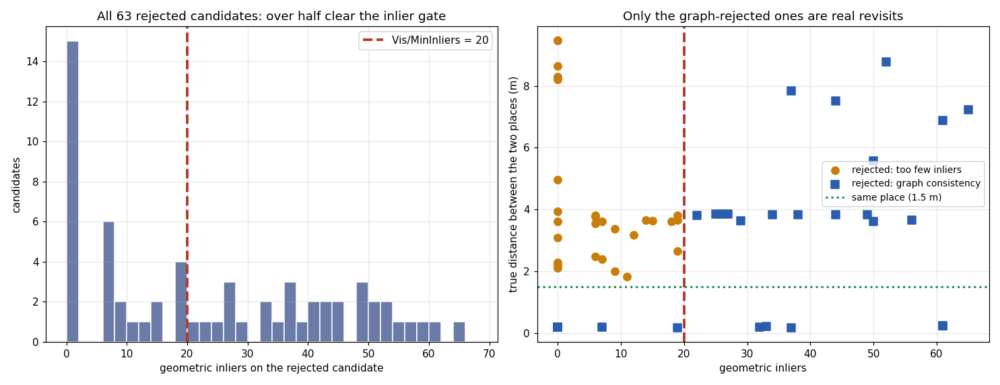

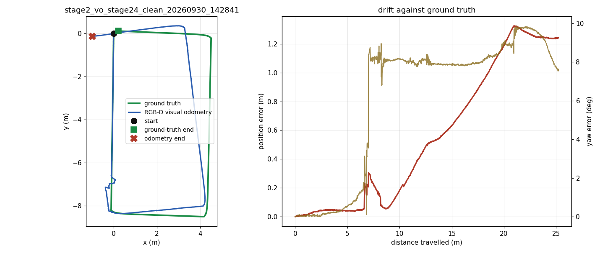

That reading held up - `Vis/MinInliers` was not the blocker - but the right-hand
panel above was measuring *true distance between the two places* without also
checking which way the robot was facing. Once heading is included, the
"graph-rejected ones are real revisits" conclusion does not survive: they are
the same corridor seen from opposite ends.

There were **no return-to-start candidates at all**, in this or any previous
run, and now we know why: the ring ends facing 92 deg away from where it
started (ground-truth yaw runs `0.0` to `-1.613` rad). The robot returns to the
starting *position* but never to the starting *viewpoint*, so there is nothing
for an appearance-based detector to match. Four runs of "0 accepted
return-to-start closures" was never a threshold problem - the opportunity was
never presented.

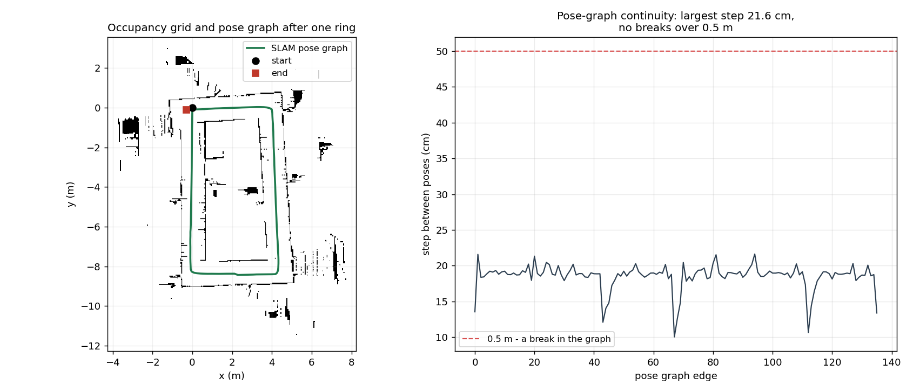

Map and graph continuity: 137 graph poses spanning 25.19 m, largest step between
consecutive poses 0.216 m, **zero gaps over 0.5 m**, one connected occupancy grid
of 19807 known cells.

### Evidence

* `verification/runs/stage2_vo_stage24_texture_20260930_180046/` - bag, results,
  console log, database snapshot, and the exact config and diff used
* `verification/runs/stage2_vo_stage24_ratio2_20260930_165553/` - the run this
  is compared against, same parameters, no strip
* `verification/runs/stage2_vo_stage24_clean_20260930_142841/` - the preserved
  ratio-4 baseline, untouched
