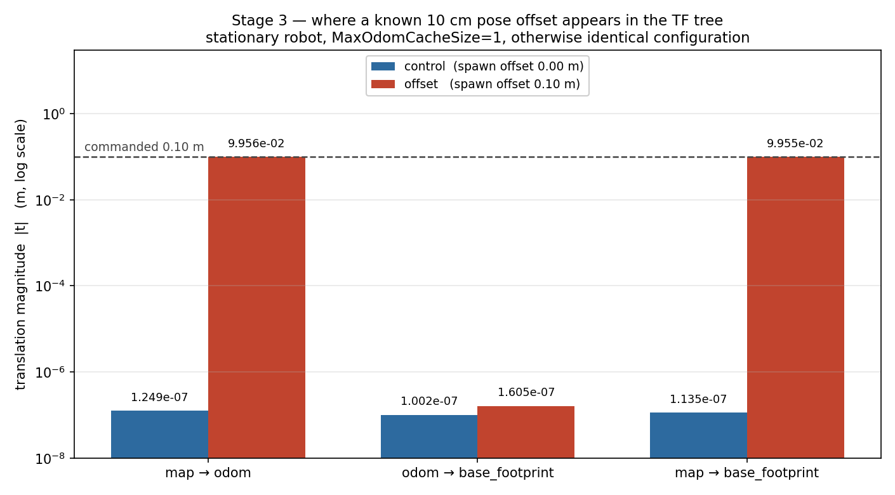
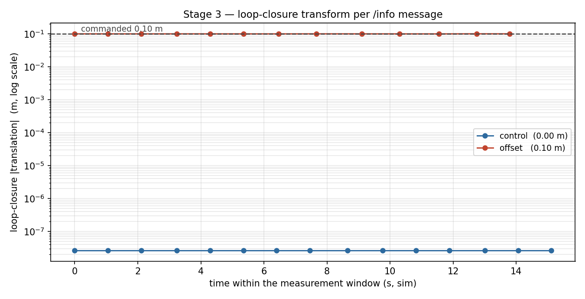
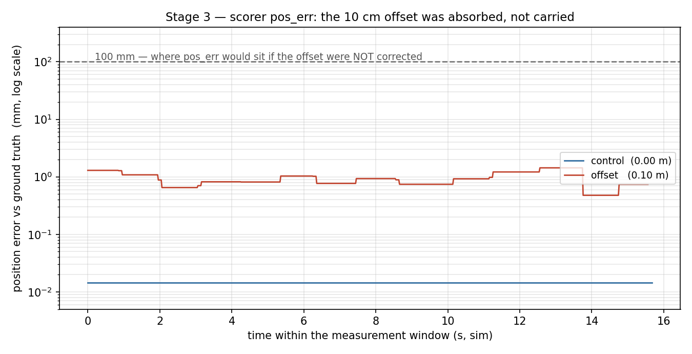

# Hexapod ROS 2 — Simulation Roadmap

This is the long-term plan for the project and the record of where it stands.
Work is **simulation only** (ROS 2 Jazzy + Gazebo Sim) until Stage 16 is complete.

## How we work

1. **One stage at a time.** Stages are never combined, and nothing from a later stage is
   built early (no face tracking, dancing or hardware work while on SLAM).
2. **Check the previous stage first.** Before starting a stage, re-run the previous
   stage's verification and confirm it still passes.
3. **Every stage ends with a test and a report:** run the verification, show the
   results, and explain what passed and what failed.
4. **Approval gate.** The next stage starts only after the results are approved.
5. **Keep what works.** Existing, verified behavior must stay stable. The gait is not
   redesigned for speed, and not modified unless a stage truly requires it.
6. **No hardware features** unless the simulation needs them (hardware is Stage 17).
7. **Record important test runs** with `ros2 bag` from Stage 2 (SLAM) onward. Recording
   must never hold up the stage itself.

Verification scripts live in [`verification/`](../verification/README.md), one per stage.

## Status

| Stage | Name | Status |
|------:|------|--------|
| 1 | Stable basic gait | ✅ **Passed** 2026-09-29 — 75/75 checks, twice (see Stage 1) |
| 2 | SLAM | ✅ **Passed** 2026-09-30 — 2.1, 2.2, 2.3, 2.4 all verified (Stage 2.4 ring: 25.19 m, 0 lost frames, ATE 0.276 m, 2.13%/m, 137-pose connected graph; see Stage 2.4) |
| 3 | Localization | 🔶 **In verification** — L0 static validated 2026-10-01 (a known +0.10 m pose offset corrected to ~0.96 mm, 13/13 accepted). L1 motion validated the same day: full 29.80 m route walked, segment B 100% localized at 0.039 m RMS. **Blocked at the NW corner** — visual odometry fails there and does not recover, so L2/L3/L4 are held (see Stage 3) |
| 4 | Nav2 | ⬜ Not started |
| 5 | Navigation tuning | ⬜ Not started |
| 6 | Head controller | 🔷 Built early (see Stage 6) — frozen until its turn |
| 7 | Simulated camera perception | ⬜ Not started (camera sensor exists, no processing) |
| 8 | Face detection and tracking | ⬜ Not started |
| 9 | Object detection | ⬜ Not started |
| 10 | Search / look-around behavior | ⬜ Not started |
| 11 | Person following | ⬜ Not started |
| 12 | Behavior system | ⬜ Not started |
| 13 | Dance behavior | ⬜ Not started |
| 14 | Interaction | ⬜ Not started |
| 15 | Behavior manager | ⬜ Not started |
| 16 | Full simulation integration | ⬜ Not started |
| 17 | Hardware preparation | ⬜ Not started — only after Stage 16 |

Legend: ✅ verified and approved · 🔶 in progress / in verification · 🔷 built ahead of plan,
not yet verified at its stage · ⬜ not started

**Immediate priority:** stable gait → SLAM → localization → Nav2.

---

## Already in place before this roadmap

- **Robot model:** 20 joints (6 legs × 3, plus pan/tilt face), foot pads, mirror-symmetric
  stance, face straight by default.
- **Control:** `ros2_control` in Gazebo, with `leg_controller` and `face_controller`
  (JointTrajectoryController).
- **Gait:** `hexapod_gait` (tripod gait with per-leg IK), driven by `/cmd_vel`
  (`linear.x` forward, `linear.y` left, `angular.z` turn).
- **Sensors in simulation:** IMU (`/imu`), face camera (`/face_camera/image`), Gazebo
  odometry (`/odom`, `odom → base_footprint` TF), and gait-phase foot contacts
  (`/foot_contacts`). There is no lidar.
- **Head:** `hexapod_head` (`/head/cmd`), which belongs to Stage 6. See that stage.
- **Media:** walking demo GIF (`demo/record_walk_gif.py`).

---

## Stage 1 — Stable basic gait

**Goal:** the existing hexapod stands correctly, walks forward and backward, turns,
strafes and follows curves, and responds correctly to `/cmd_vel`. It must stop cleanly,
without dragging its feet, and stop by itself if commands are lost. Keep the current
gait. Do not redesign it for speed.

**Closed 2026-09-29: 75/75 required checks, in two consecutive runs.**

**Verification:**
- `python3 verification/stage1_basic_gait.py` — 75 checks in Gazebo against ground truth.
- `colcon test --packages-select hexapod_gait hexapod_head` — 23 offline unit tests.

### Final results (two runs, same setup)

| Measurement | Limit | Run A | Run B |
|---|---|---|---|
| Required checks | all | **75/75** | **75/75** |
| Worst planted-foot slide when stopping | ≤ 5.0 mm | 2.8 mm | 2.7 mm |
| Worst planted-foot slide when starting | ≤ 5.0 mm | 0.6 mm | 0.6 mm |
| Slowest return to the stand pose | ≤ 1.0 s | 0.83 s | 0.82 s |
| Standing again after `/cmd_vel` goes silent | ≤ 1.5 s | 1.32 s | 1.32 s |
| Gazebo real-time factor during the run | reported | 0.93 | 0.93 |

Walking (run B): forward 84.0 cm and backward 85.9 cm in ~10 s (about 8.4 cm/s),
turning ±19°/s, strafing ±72 cm in ~8 s, body tilt ≤ 0.1°, one tripod lifted at a
time in 100% of samples, 50 Hz leg command stream, and no gait warnings or errors.

### What changed in this stage

1. **Lifted-foot start/stop transitions.** The gait is a small state machine
   (`STANDING → STARTING → WALKING → STOPPING`). Feet move between the walking and
   standing footprints **only while lifted**, one tripod at a time, with a short
   settle pause before the other tripod lifts. Steady walking is untouched, and a
   unit test proves the stride matches the original formula exactly.
2. **`/cmd_vel` watchdog (0.5 s).** If commands stop arriving, the gait stops the
   robot through that same safe transition. README examples publish continuously.
3. **Simulation time.** The gait's control timer, phase, transitions and watchdog run
   on Gazebo's `/clock`, as do the verification's measurements. Before this, the gait
   ran on wall-clock time and stepped too fast for the physics whenever Gazebo fell
   behind real time, which made results depend on machine load.
4. **Leg controller: `interpolate_from_desired_state`.** Each streamed trajectory used
   to restart interpolation from the lagging *measured* state, which delayed commands
   150–180 ms and executed only 27–39% of the planned joint motion.
5. **Faster simulated servos with soft limits.** `position_proportional_gain` 0.1 → 0.3
   (~0.1 s → ~33 ms response). At 0.3 a gravity-loaded joint driven exactly onto a hard
   stop locks up in the physics engine, so the head node keeps commands 0.02 rad inside
   the URDF limits (verified: 5 full-range cycles with no sticking, versus jamming on
   the first attempt without the margin).
6. **Better verification.** Checks for planted-foot dragging (start and stop),
   continuous walking, and the watchdog; stops now sample different gait phases; the
   real-time factor is recorded; phase windows are half-open.

Items 4 and 5 fixed the root cause: the legs now execute ~95% of the planned motion
instead of about a third, so they are no longer still catching up when a foot takes
load. As a side effect, walking is about 3× faster with the gait itself unchanged
(2.8 → 8.4 cm/s at the same command).

### How it got there

| Attempt | Result |
|---|---|
| Original gait | 56/57 — stop took 1.2–1.3 s, feet dragged 14–40 mm |
| New drag/watchdog checks on the original gait | 64/75 — baseline proving the checks catch it |
| Lifted-foot transitions + watchdog | 73/75 — starting clean, stops still slid 6–9 mm |
| \+ controller interpolation fix | 75/75, but only 0.2 mm of margin |
| \+ simulation time, pause tuned to 0.075 s | 74/75 and 75/75 — repeatable, but on the 5 mm limit |
| Gentler step profile ("Option 1") | Rejected: worst case 5.6–8.2 mm. Measurement showed the slide comes from lagging servos catching up on a planted foot, which a smoother path cannot remove |
| Faster servos + soft limits ("Option 2") | **75/75 twice, worst slide 2.7–2.8 mm** |

### Findings to carry forward

- **Stride limit.** The stride saturates at about 0.2 m/s of translation or 0.7 rad/s of
  rotation, each leg clamped separately. Nav2 limits must stay inside this range.
- **`/odom` is perfect in simulation.** It comes from Gazebo's OdometryPublisher and has
  no slip error, while a real robot's odometry drifts. Keep this in mind when judging
  SLAM and localization.
- **Leg joints still use hard limits.** A 0.02 rad margin in the leg IK would clip the
  walking swing of `leg_l3`, so only the head has soft limits. The legs showed no
  sticking in four full runs at the faster gain; revisit if a leg ever freezes.
- **Test environment.** Results are reported with Gazebo's real-time factor. A GNOME
  screen recording (~1100% CPU) once dropped it to 0.6 and produced two misleading
  failures. Use `demo/record_walk_gif.py` to record the robot instead.

## Stage 2 — SLAM

**Goal:** build a map of a simulated environment while the hexapod walks, with
loop closure, and verify the map.

### Sensing decision (2026-09-29)

**RGB-D camera → RTAB-Map** (`rtabmap_odom` for visual odometry, `rtabmap_slam` for
the graph, loop closure and map). No lidar and no depth-to-laserscan: the simulation
mirrors the sensing the real robot will use.

Why RTAB-Map over the alternatives on this stack (Ubuntu 24.04 / ROS 2 Jazzy):

| Option | Jazzy packages | Loop closure | Map for Nav2 | Verdict |
|--------|----------------|--------------|--------------|---------|
| **RTAB-Map** 0.23.7 | apt binaries | yes, appearance-based | occupancy grid + `map → odom` | **chosen** |
| ORB-SLAM3 | none (unmaintained wrappers) | yes | sparse points only | rejected |
| Isaac ROS Visual SLAM | Humble/Jetson focus | yes | no grid | rejected |
| OpenVINS / VINS-Fusion | partial ports | VINS only | no | rejected: odometry only |
| slam_toolbox | apt binaries | yes | yes | excluded: needs a LaserScan |

Ground-truth odometry is **not** used to help SLAM. Gazebo's `/odom` is kept for
scoring only; visual odometry will own `odom → base_footprint`.

### Test facility (built and validated 2026-09-29)

`hexapod_worlds` holds a bespoke **industrial robotics facility**, 15 × 11 m, generated
from primitives and procedural textures (`generate.py`) so it loads with no downloads
and stays reproducible. Eight perimeter rooms — robotics lab, loading, testing, storage,
workshop, maintenance, parts store, equipment room — around a ring corridor with an
equipment core inside the loop.

Designed for this robot and this sensor:

- **Three nested loops** for loop-closure tests: ring 25.6 m, core 19.5 m, rooms 12.0 m.
  At ~9 cm/s a short loop is walkable in minutes, so it gets tested often.
- **START sits on the ring, inside a loop**, not at the end of a corridor.
- **Alternative routes**: every room opens onto the ring, several open into each other,
  giving T-junctions and four-way choices for Nav2 later.
- **Detail placed low.** The camera is 0.14 m off the floor, so the world puts its
  features there: floor lane markings, kick plates, door numbers, pallets, pipe runs.
- **Zone identity**: each area has its own wall and floor materials; the two corridor
  legs are deliberately similar, to test perceptual aliasing honestly.

### Validation results

| Check | Result |
|---|---|
| World loads, no missing resources | ✅ 3 controllers active, no asset errors |
| Props vs walls / each other / START | ✅ 0 overlaps (`validate_slam_world`) |
| Every zone reachable from START | ✅ 10/10 zones, 53.8 m² walkable |
| Loops walkable with a lane | ✅ ring 1.20 m, core 0.90 m, rooms 0.90 m narrowest |
| Doorways | ✅ widened to 1.1 m (1.0 m clear of frames) for a legged robot |
| Visual features from robot height | ✅ 18/18 viewpoints, 343–1476 ORB features (min 150) |
| Places distinguishable | ✅ no pair above 15% descriptor match |
| Robot walks in the facility | ✅ 9.9 cm/s straight down the corridor |
| Robot walks a full loop | ✅ ring loop 24.6 m in 4.8 min, back to START, body tilt ≤ 0.4° |
| Robot passes through doorways | ✅ core loop: in the south door, out the north, tilt ≤ 2.7° |
| Real-time factor, world alone | ✅ 0.99 (empty world: 1.00) — the world itself is nearly free |
| Real-time factor, with robot + camera | ⚠️ 0.54–0.62; the robot's 30 Hz camera rendering the scene is the cost |

Offline unit tests (`colcon test --packages-select hexapod_worlds`, 8 tests) hold the
layout to its invariants: zones tile the floor, doorways sit inside their walls and stay
at least 1.0 m wide, geometry stays inside the building, loops close, START is on the
ring but outside the core, and every zone has a camera viewpoint.

Two bugs the validation caught, both fixed: a ground plane under the floor slabs made
the feet chatter between coincident surfaces (the robot stepped but barely moved,
1.5 cm in 25 s), and the world was first built with ~350 one-box links, which halved
the real-time factor before the geometry was merged into a few links.

### Stage 2.1 / 2.2 — RGB-D camera and camera TF (done 2026-09-29)

The head now carries a native Gazebo `rgbd_camera`: colour and depth are rendered
from the same optics, so depth is real geometry rather than something inferred from
the colour image.

| Stream | Topic | Type | Detail |
|--------|-------|------|--------|
| Colour | `/face_camera/image` | `sensor_msgs/Image` | 640×480 `rgb8`, 15 Hz |
| Depth | `/face_camera/depth_image` | `sensor_msgs/Image` | 640×480 `32FC1` (metres), 15 Hz, 0.29–8.9 m observed, 0.1–12 m clip |
| Intrinsics | `/face_camera/camera_info` | `sensor_msgs/CameraInfo` | fx = fy = 337.36, cx 320, cy 240, 87.0° × 70.9° FOV |
| Point cloud | `/face_camera/points` | `sensor_msgs/PointCloud2` | organised 640×480, `xyz` + greyscale intensity, 15 Hz, straight from the sensor |

Colour and depth share a stamp exactly (107/107 frames, worst offset 0.000 ms), which
is what RGB-D odometry needs.

**Camera frames (REP 103/145).** The camera has a physical frame and an optical frame,
both hanging off the head so pan and tilt carry them:

```text
base_footprint -> base_link -> face_bracet_base_link_1 -> face_link_1
                -> face_camera_link -> face_camera_optical_frame
```

At neutral head the optical frame sits at (+0.124, −0.102, +0.060) m from
`base_footprint`, with Z along the robot's forward axis, Y down and X right — the
convention every ROS vision node assumes. Images are stamped
`face_camera_optical_frame`, not the head link. Commanding the head ±17.2° moves the
camera view by exactly ±17.2° in pan and tilt, and it returns to neutral.

**Ground truth is off the TF tree.** Gazebo's odometry is published as
`/odom_ground_truth` (50 Hz) and its `odom → base_footprint` TF is no longer bridged,
so nothing feeds perfect poses into TF. That transform is left free for visual
odometry to own from Stage 2.3. RViz's fixed frame moved to `base_footprint` until
SLAM provides `map`/`odom`.

**Performance** (RGB-D at 15 Hz replaces RGB at 30 Hz, so cost went down despite
adding depth and a point cloud):

| Configuration | Before (RGB 30 Hz) | After (RGB-D 15 Hz) |
|---|---|---|
| Facility, GUI | 0.49–0.50 | **0.62** |
| Facility, headless | 0.62 | **0.65** |
| Empty world, Stage 1 run | 0.92–0.94 | **0.96** |
| CPU (headless facility) | — | 177% of 1600% (16 cores) |
| GPU (Quadro T1000) | — | 33% |

All four topics publish at 15.2 Hz in simulation time. The facility world alone still
runs at 0.99; the remaining gap is rendering.

**Regression:** Stage 1 verification 75/75 in the empty world, unchanged criteria;
unit tests 31/31 (gait 12, head 11, worlds 8); the robot walks 9.5 cm/s in the
facility with the sensor mounted.

### Stage 2.3 — RGB-D visual odometry (blocked 2026-09-30)

`rtabmap_odom/rgbd_odometry` is up and healthy: 14.9 Hz, ~35 ms per frame, ~450
features / 211 inliers, 0.0 mm drift standing still for 20 s, and it owns
`odom → base_footprint` with ground truth kept entirely out of the pipeline.
`hexapod_slam` provides the launch, the experiment runner, an offline bag scorer
and the run-reset helper.

**Run A (ring loop) is the only experiment that could be completed.** The
odometry tracked **8.26 m of the 25.19 m ring at 1.2% drift per metre**
(ATE 0.058 m, final error 0.102 m, max yaw error 4.15°) and then lost tracking at
the first corner and never recovered.

**Resolved 2026-09-30 by moving the camera 60 mm forward** (it sat 38.4 mm inside
the face shell, and a depth camera whose origin is inside its own model's mesh
renders nothing off-axis). The ring loop now tracks end to end: 25.19 m, 0 lost
frames, 0.9% drift per metre, final error 0.231 m, final yaw error 0.05 deg.

**The underlying blocker was in the simulator, not in our code.** The head depth camera
returns 100% infinite depth whenever the robot's heading is more than ~15° away
from a world axis, so every corner blanks it. Colour is unaffected. Six controlled
experiments have narrowed it down — see [KNOWN_ISSUES.md](KNOWN_ISSUES.md):

| Experiment | Result |
|---|---|
| Un-lump the camera link (Fix 1) | no change |
| Split `rgbd_camera` into `camera` + `depth_camera` (Fix 2) | colour fixed, depth still fails |
| `ogre` render engine instead of `ogre2` (Fix 3) | worse: depth fails at *every* heading |
| Robot completely static (joint drift 1e-18 rad) | fails identically, so motion is not the trigger |
| Depth sensor moved to `base_link`, pose preserved to 5e-10 m | fails identically, so the head chain is not the trigger |
| Same sensor in a standalone model | works at every heading |
| Minimal one-link **dynamic** model with the same sensor | works at every heading, so a dynamic model is not the trigger |
| That minimal model + one hexapod STL visual | works at every heading, so mesh visuals are not the trigger |
| Same model + the STL as a collision too | works at every heading, so mesh collisions are not the trigger |
| 20-link model of plain boxes, 19 fixed joints | works at every heading, so link count/structure is not the trigger |
| **21 links each carrying its real STL, no ROS software at all** | **fails at the same 9 headings as the robot - reproduction case found** |
| **That same model with the camera moved 0.34 m clear of its own meshes** | **works at every heading - the trigger is a camera embedded in the model's own mesh geometry** |
| **Real robot: camera moved 60 mm forward, out of `face_link_1`** | **fixed - 17/17 headings, and the full 25.19 m ring loop now tracks with 0 lost frames** |

**Repeatability (Runs B and C, 2026-09-30).** Two further ring loops on the
frozen configuration, nothing changed between them. Depth stayed valid in every
frame of both, at every heading - the rendering defect is gone. Run B tracked the
full 25.19 m with 0 lost frames at 2.6% drift per metre; Run C tracked 20.94 m
and then lost visual tracking at the north-west corner, 0.68 m from a
featureless block wall, with depth still 100% valid. Across the three good runs
drift per metre ranged 0.9% to 2.6%. Open-loop odometry alone is therefore not
dependable through texture-poor corners, which is what loop closure in Stage 2.4
exists to fix.

**Next in this stage:** Stage 2.4 below.

### Stage 2.4 — RTAB-Map SLAM (passed 2026-09-30)

**Goal:** add mapping and loop closure on top of Stage 2.3's odometry, and
check the result against the world's true geometry.

Validation run: `verification/runs/stage2_vo_stage24_texture_20260930_180046/`
(bag, database snapshot, console log, and the exact configuration and diff used).
Implementation committed in `a6275a4`; the world change it depends on in `82301e2`.

Configuration under test, verified on the live nodes before driving:

    Vis/PnPVarianceMedianRatio = 2
    Odom/ResetCountdown        = 0
    Vis/MinInliers             = 20
    RGBD/OptimizeMaxError      = 3.0

#### PASS criterion

Ten conditions, each measured from the recorded bag and database. Re-running
the same route and re-scoring with `ros2 run hexapod_slam score_bag` reproduces
every number in the right-hand column.

**The thresholds below are this project's own Stage 2.4 acceptance values, not
a general SLAM standard.** They were chosen for this robot on this route: a
hexapod walking a 25.19 m indoor ring with a single RGB-D camera 0.060 m off
the floor and no wheel odometry, IMU fusion or external reference. They say
what this stage had to clear in order to move on, and nothing about what any
other system should achieve. Comparing them against published SLAM benchmarks
is not meaningful.

| # | Condition | Stage 2.4 acceptance threshold | Measured |
|---|---|---|---|
| 1 | Complete the ring route | full 25.19 m | 25.19 m |
| 2 | Lost RGB or depth frames | 0 | 0 |
| 3 | Gaps in the camera stream | none over 0.5 s | 0 (worst 0.066 s) |
| 4 | ATE (RMSE) against ground truth | ≤ 0.50 m | 0.276 m |
| 5 | Final position error | ≤ 1.00 m | 0.537 m |
| 6 | Drift per metre | ≤ 3.0 % | 2.13 % |
| 7 | Final yaw error | ≤ 5.0° | 2.19° |
| 8 | Pose graph continuous | no step over 0.50 m | 137 poses, largest step 0.216 m |
| 9 | Driven route in one connected region of the occupancy grid | all poses | 137 of 137 |
| 10 | Loop closures | ≥ 1 genuine accepted, 0 false accepted | 2 accepted, 0 false |

Condition 9 in full: the grid holds 19,807 known cells, 4,408 occupied and
15,399 free. The free space forms 112 connected components; the largest is
35.9 m² of the 38.5 m² total (93.4 %) and contains all 137 pose-graph poses. The
remaining 2.6 m² is 111 pockets seen through doorways and never entered.

Condition 10 in full: the two accepted closures are nodes 148 and 149 (14.6 m
and 14.8 m into the ring) back to node 138 (12.75 m) — the robot looking back at
the north-east corner after turning it. They reduced the pose graph's
end-to-start gap from the raw odometry's 0.537 m to 0.311 m.

The database also holds 67 further accepted links, all joining nodes recorded
while the robot stood still before the drive began. They carry no displacement,
they are not closures observed during motion, and they are **not counted toward
condition 10** — recorded here only so the 69 links in the database are not
mistaken for 69 revisit detections.

Of the 76 rejected candidates (55 on inlier count, 21 on graph consistency),
every one was checked against ground truth by timestamp: all 76 place the robot
4.6–9.5 m apart facing approximately 180° opposite, so none is a revisit. These are the corridor look-alikes the facility
was built to contain, and rejecting them is the required behaviour.

#### Return-to-start loop closure is not a Stage 2.4 requirement

The validation route finishes approximately 92° away from its starting heading
(ground-truth yaw runs 0.000 rad to −1.613 rad). The robot returns to the
starting *position* but does not reproduce the starting *viewpoint*, so no
return-to-start match is available to an appearance-based detector. RTAB-Map
generated zero return-to-start candidates in this run and in the three runs
before it. This is a property of the route, not of the SLAM configuration, and
it is therefore excluded from the criterion above.

A revisit-capable route — one that returns the robot to a previously observed
viewpoint — will be introduced for **Stage 3 localization testing**. The
validated Stage 2.4 route, run and artefacts stay unchanged, so Stage 2.4
remains reproducible from the recorded bag.

#### What this stage delivers

`rtabmap.launch.py`, `rtabmap.yaml`, `slam_stack.launch.py` (whole stack in one
ordered command), an RViz view, and SLAM-pose scoring in the experiment runner.
TF ownership is split: `rgbd_odometry` owns `odom → base_footprint`, `rtabmap`
owns `map → odom`.

Getting here required one change to the world: the face camera sits 0.060 m off
the floor, and at the ring's north-west corner it faced a wall whose kick plate
gave zero ORB keypoints, which ended three earlier runs at 20.96–21.03 m. A
single visual-only decal on that wall raised the count to 207–909 with no change
to any collision geometry. Measurements in
[KNOWN_ISSUES.md](KNOWN_ISSUES.md) section 2.

## Stage 3 — Localization

**Goal:** localize against the map from Stage 2.

- Verify the estimated pose against Gazebo ground truth.
- Verify TF relationships (`map → odom → base_footprint`).
- Localization stays stable while the hexapod walks and turns.
- Introduce a **revisit-capable route** that returns the robot to a previously
  observed viewpoint, so return-to-start loop closure can be tested. The Stage
  2.4 ring finishes ~92° off its starting heading and cannot present that
  match; the Stage 2.4 route is left unchanged so its validation run stays
  reproducible.

### Stage 3 L0 — known-pose-offset experiment (static, 2026-10-01)

**Why this experiment exists.** Every earlier Stage 3 L0 run spawned the robot
at world (3.300, 3.300), which *is* the reference map's origin. With the robot
standing exactly where the map says the map begins, a perfect localization
correction and no correction at all produce the same numbers: `map → odom`
measured 1.2e-07 m and `pos_err` measured 1.4e-05 m, and neither value could
be read as evidence either way. Both were tautologies of the geometry, not
measurements of the localizer. The experiment removes the tautology by moving
the robot a known distance away from the map origin and asking whether
RTAB-Map puts it back.

**Design.** Two runs, taken 15 minutes apart on the same host, identical in
every respect except the spawn pose:

| | control | offset |
|---|---|---|
| run | `verification/runs/stage3_L0_offset0_control_20261001_141040/` | `verification/runs/stage3_L0_offset10cm_20261001_142636/` |
| `spawn_offset_x` | 0.00 m (argument not passed) | **0.10 m** |
| everything else | world, robot, camera, odometry, controllers, RTAB-Map config, `RGBD/MaxOdomCacheSize=1`, frozen reference, scorer, `--settle 30`, shutdown | identical |

The spawn offset is introduced by a launch argument (`3471caa`), not by editing
`START`. `START` is also the scorer's frame anchor for its map→world
conversion, so changing it would have moved the spawn and the measuring stick
together and cancelled the effect. The offset is therefore the single
experimental variable; the live 516-entry parameter dump differs between the
two runs only in `database_path`. Preflight passed 20/20 mandatory and 2/2
advisory on both.

**The offset was confirmed independently, from `/odom_ground_truth`, not from
the launch argument:**

| | control | offset | difference |
|---|---|---|---|
| ground-truth x | 3.299987542 m | 3.399987791 m | **+0.100000249 m** |
| ground-truth y | 3.299993039 m | 3.299993428 m | +0.000000388 m |

The commanded 0.10 m was delivered to within 2.5e-07 m, on one axis.

#### Where the displacement appeared

Measured on all three edges with a full-precision TF2 listener, 414 samples.
The design did **not** assume the answer; `rgbd_odometry`'s initialization
behaviour had been inferred from configuration, never tested.

| edge | control | offset |
|---|---|---|
| `map → odom` | 1.2489e-07 m | **9.9525e-02 m** |
| `odom → base_footprint` | 1.0024e-07 m | **1.6049e-07 m** |
| `map → base_footprint` | 1.1348e-07 m | **9.9524e-02 m** |

`odom → base_footprint` did not move. The whole displacement appeared in
`map → odom`, the edge RTAB-Map owns. This confirms experimentally that
`rgbd_odometry` initialises `odom` at the robot's spawn pose, which until now
was an assumption. The sign is also right, not only the magnitude: `map_y =
−0.0995` decodes through `world_x = START_x − map_y` to world x ≈ 3.3995,
which is where the robot physically was.



#### Measured response

| Measurement | control (0.00 m) | offset (0.10 m) |
|---|---:|---:|
| loop-closure translation | 2.68635e-08 m | **0.0993457 .. 0.0999339 m** |
| loop-closure rotation | 0.0° | 0.00400663 .. 0.015051° |
| identity / near-identity / non-identity | 0 / 15 / 0 | **0 / 0 / 13** |
| `map → odom` corrections | 0 | **13**, largest step 0.001 m |
| optimization error | 8.6274e-09 | 4.0981e-04 .. 6.6876e-03 |
| optimization iterations | 1 | 2 .. 6 |
| odometry cache poses | 2 | 2 |
| accepted / rejected hypotheses | 15 / 0 | **13 / 0** |
| highest hypothesis value | 0.994358 | 0.978548 |
| visual matches | 427 | 187 .. 192 |
| visual inliers | 424 | 143 .. 153 |
| samples / localised | 785 / 785 | 779 / 779 |
| `/info` messages received | 15 | 13 |



#### Two independent position measurements, in agreement

| | TF-derived pose vs ground truth | scorer `pos_err` RMS |
|---|---:|---:|
| control | 1.428331e-05 m | 1.428331e-05 m |
| **offset** | **9.173794e-04 m** | **9.607894e-04 m** |

These are independent: one composes the TF tree and decodes `map →
base_footprint` into world coordinates, the other is the scorer's own
comparison against `/odom_ground_truth`. On the offset run they agree to
within 4% of a sub-millimetre quantity. What they agree on is the point —
**0.96 mm, not 100 mm.** Had the localizer not corrected, both would read
≈ 0.10 m, because `odom → base_footprint` stayed at identity and the error
would have had nowhere else to go.



#### Reference integrity

The canonical reference was never opened by either run; each copies it to
`<run>/reference.db` first, and the launch refuses to start unless size,
sha256, SQLite integrity and vocabulary all match the manifest.

| | |
|---|---|
| frozen reference sha256 | `9366c429b55820086405263d28f80146243d914b37c54ee0e91ef6bc460e4a93` — unchanged before and after both runs |
| mode / mtime | `444`, mtime still 2026-09-30 23:27:26 — never written |
| working copy node growth | 587 → 587 (**+0**) |
| working copy link growth | 792 / 136 neighbour / 69 accepted (**+0 / +0 / +0**) |
| working copy dictionary growth | 35907 words, 174973 features (**+0 / +0**) |
| working copy integrity | `ok` |

#### What this establishes, and what it does not

**Establishes:** for this configuration, RTAB-Map localization produces a real
correction. A known 10 cm offset is recognised, carried in the loop-closure
transform, optimised into the pose graph and published on `map → odom`, and
the robot's estimated pose ends up within about 1 mm of ground truth. It
follows that the ~1e-7 m `map → odom` values measured at the nominal spawn
were **numerical residue**, not a correction — the same pipeline produces
1e-1 m when there is something real to correct.

**Validates specifically:** the **static +0.10 m known-pose offset under the
tested configuration**. Nothing wider.

**Does not establish:** general localization robustness, the maximum offset
the method tolerates, motion robustness, dynamic relocalization performance,
or behaviour at larger offsets. Those are later experiments.

**Observed, recorded neutrally:** feature matching fell substantially when
viewing from 10 cm off the mapped pose — matches 427 → 187..192 and inliers
424 → 143..153, with the highest hypothesis value 0.994 → 0.979. Recognition
remained intact throughout: 13 of 13 hypotheses accepted, 0 rejected, 779 of
779 samples localised. This is recorded as measured behaviour, not as a
failure, and it is the kind of quantity a later offset-magnitude experiment
would be designed around.

#### The measurement chain had to be repaired first

Three earlier L0 reports claimed "0 recognition events". The scorer was
subscribed to `/rtabmap/info`, which does not exist — the topic is `/info`, so
no messages were arriving at all and the reports described the scorer's own
defect. Those three runs' recognition findings are retracted. The chain was
then rebuilt one reviewed commit at a time: correct topic (`ba191df`), a
received-message counter so silence can never again be misread as absence
(`0448867`), per-message internal state (`0535eb7`), a parameter-override path
so a single parameter can be varied through the normal launch
procedure (`6c147f9`), and the loop-closure transform, odometry-cache and
optimization state (`3f5be56`) that this experiment reads.

### Stage 3 L1 — localization under motion (2026-10-01)

Run: `verification/runs/stage3_L1_20261001_144802/`. One run, `spawn_offset_x=0.0`,
`RGBD/MaxOdomCacheSize=1` — the same validated protocol as the static work, with
motion as the only change. Pre-run gates: HEAD `091b272`, tree clean, live
516-entry parameter dump differing from the static control in `database_path`
alone, reference sha256 `9366c429…`, mode `444`, scorer instrumentation present,
exactly one follower, preflight 20/20 mandatory and 2/2 advisory.

**L1 is the segment-B scoring window of the full facility drive, not a short
isolated drive.** `--experiment L1` runs `drive_facility_loop --loop localization`,
which walks the whole A–K route; the `experiment` argument only labels the run and
picks which window is reported. The scorer computes every window from the same
data, so one drive populates L1, L2, L4 and L3 at once.

#### Execution

| | |
|---|---|
| route | completed — ended (7.272, 3.194), 0.252 m from the final waypoint (7.50, 3.30), inside the 0.35 m `REACHED` tolerance |
| distance actually walked in Gazebo | **29.32 m** (planned 29.80 m; the follower cuts corners within tolerance) |
| duration | **195.9 s** simulated, **9796** samples |
| follower | **exit code 0**, exactly one follower, no stall, no timeout |
| recognition events | **169**, across 74 distinct reference nodes, from 153 `/info` messages |
| reference graph growth | **zero** — 587 nodes, 792 / 136 / 69 links |
| dictionary growth | **zero** — 35907 words, 174973 features |
| frozen reference sha256 | `9366c429b55820086405263d28f80146243d914b37c54ee0e91ef6bc460e4a93`, unchanged; mode `444`, mtime untouched |

Whole-run figures: 7144 / 9796 samples localised (72.9%), position RMS 0.2597 m,
max 0.9744 m, yaw RMS 12.542°, max 82.5314°. 82 `map→odom` corrections, largest
1.1828 m / 34.229°. These aggregate the healthy and failed halves of the route and
are not a performance figure for any one condition.

#### Per segment

| seg | description | samples | localised | pos RMS | pos max | yaw RMS | recog | VO-lost |
|---|---|---:|---:|---:|---:|---:|---:|---:|
| A | dwell at START | 885 | 99.8% | 0.000 | 0.009 | 0.01° | 32 | 0 |
| **B** | **south leg eastbound — the L1 window** | **2271** | **100.0%** | **0.039** | **0.354** | **1.37°** | **43** | **0** |
| C | SE turn | 224 | 100.0% | 0.158 | 0.450 | 11.24° | 3 | 0 |
| D | east leg northbound | 1056 | 100.0% | 0.241 | 0.697 | 2.73° | 25 | 0 |
| E | NE turn | 222 | 100.0% | 0.098 | 0.163 | 4.17° | 5 | 0 |
| F | north leg westbound | 2182 | 100.0% | 0.288 | 0.726 | 3.45° | 33 | 101 |
| G | NW turn | 215 | 100.0% | 0.839 | 0.876 | 46.78° | 2 | 215 |
| H | west leg southbound | 1058 | 8.6% | 0.919 | 0.974 | 80.04° | 26 | 1058 |
| I | turn to the START heading | 218 | 0.0% | — | — | — | 0 | 218 |
| J | south leg revisit | 1052 | 0.0% | — | — | — | 0 | 1052 |
| K | dwell at the overlap end | 413 | 0.0% | — | — | — | 0 | 413 |

Scoring windows: L0 [A] 885 samples 99.8% RMS 0.0003 · **L1 [B] 2271 samples 100.0%
RMS 0.0390 max 0.3544 yaw RMS 1.3683** · L2 [BCDEFG] 6170 samples 100.0% RMS 0.2562 ·
L4 [HI] 1276 samples 7.1% RMS 0.9187 · L3 [JK] 1465 samples 0.0%.

#### The L1 window in detail

| | |
|---|---|
| samples / localised | **2271 / 2271 (100.0%)** |
| ground truth | (3.311, 3.300) → (11.367, 3.189), 8.06 m, t+17.7 .. t+63.1 s |
| position error | mean 0.0229 m, **RMS 0.0390 m**, max 0.3544 m |
| yaw error | mean 0.815°, **RMS 1.3683°**, max 10.189° |
| recognition | **43 events**, longest interval **8.91 s**, median 1.06 s |
| `/info` | 39 messages — 24 with an accepted hypothesis, 15 without |
| VO-lost frames | **0** |
| TF availability | `map→odom`, `odom→base_footprint`, `map→base_footprint` all **2271 / 2271** |
| `map→odom` | 0.0000 .. 0.1813 m, mean 0.0384 m |
| `map→odom` corrections | **24**, largest **0.1304 m**, median 0.0059 m |

On the accepted hypotheses in B: matches 95–304 (median 208), inliers 53–174
(median 120), loop translation 0.0355–0.5227 m, loop rotation 0.002–0.595°,
optimization 1–6 iterations. The longest gap of the whole run, 8.91 s, fell early
in B at t+20.5 → t+29.4 s between (3.81, 3.29) and (5.39, 3.27).

#### Where it degraded

Degradation begins in **F** and becomes total at **G**:

| | |
|---|---|
| first lost frame | t+134.8 s, segment **F** |
| position | **(3.989, 7.801)** — 0.696 m from the NW corner waypoint (3.30, 7.70), 1.309 m from the west wall face |
| orientation | body yaw −91.2°, so travel heading **+178.8° — due west**. `gt_yaw` is the body yaw and the robot faces its own −Y, so `heading = body_yaw − 90°` |
| the turn had not started | heading held a constant 178.8° from t+120 to t+136.5 s; the turn began at t+137.5 s, **2.7 s after VO was already lost** |
| recovery | **none** — 0 of the following 3056 frames regained tracking |
| last valid localization pose | t+142.5 s, segment H, (3.354, 7.129), position error 0.943 m |
| longest VO outage | 63.228 s, 414 lost frames; longest TF outage 53.4 s |

H dropped to 8.6% localised, and I, J and K produced no localization pose at all.
This is the NW corner recorded in `KNOWN_ISSUES.md` §2 — the camera 0.060 m off the
floor facing a flat kick plate. The Stage 2.4 decal was sufficient for that run; it
was not sufficient here. **The failure is unresolved**, and L2, L3 and L4 all cross
that corner, so they stay blocked until it is characterised.

#### This is real Gazebo motion

Challenged during the run by an observation that RViz appeared to show motion while
the Gazebo robot looked stationary. Diagnosed in
`verification/runs/diag_gz_rviz_20261001_152043/` with nothing modified:

1. **L1 is valid Gazebo motion evidence.** The Gazebo server received no signal and
   ran throughout — `Received signal` appears 0 times in the L1, offset and control
   launch logs.
2. **RViz was not driven by ground truth.** `ros_gz_bridge_gazebo.yaml` bridges
   `/odom_ground_truth` one-way `GZ_TO_ROS` and deliberately does **not** bridge
   `odom → base_footprint`; simulator poses never enter TF.
3. **Gazebo and ROS ground truth agree exactly.** Read directly from Gazebo
   transport, the model pose was x 3.2999878698759124 before and 3.9912791906938931
   after a 15 s walk, matching `/odom_ground_truth` digit for digit.
4. **RViz motion came from `rgbd_odometry` plus RTAB-Map's `map→odom`.** Over a
   controlled walk, Gazebo's physical model travelled 0.6518 m and TF travelled
   0.6597 m — agreement to **7.9 mm**, with joints swinging 20.17° / 27.94° / 25.57°
   and the camera streaming 201 frames at 15.2 Hz.
5. **The stationary-looking Gazebo view was a camera-follow difference, not a
   simulation-state problem.** RViz's active view is an Orbit named "Chase" with
   `Target Frame: base_footprint`, so its camera follows the robot. Gazebo's GUI
   camera sat fixed at (3.107, 4.658, 0.564) with `/gui/currently_tracked` empty,
   so 0.65 m of travel across a 12 × 8 m facility is barely visible.
6. **The NW-corner VO failure is a genuine perception failure** and is the one place
   where the Gazebo → sensors → SLAM/TF → RViz chain really did break: after
   t+134.8 s `odom → base_footprint` froze while the robot kept walking.

#### Not a regression against the static experiment

L1's 0.0390 m window RMS and the static run's 1.428331e-05 m are **different
conditions**, not a before-and-after. The static runs stood still at the mapped
origin; B is 8 m of walking. The fair within-run control is this run's own dwell A:
885 samples, 99.8% localised, 0.0003 m RMS, which reproduces the static result.

#### Known instrumentation limitation (scorer, not the robot)

The scorer's summary reports loop-transform rotation up to 180°. That figure is an
artefact and does not describe any robot motion:

* **61 of 153** `/info` messages carry an all-zero quaternion `(0, 0, 0, 0)` —
  RTAB-Map's null/empty transform.
* The scorer computes `2·acos(|w|)`, which turns `w = 0` into exactly 180°.
* All 61 have translation exactly 0.0 and **none** has an accepted hypothesis.
* On accepted hypotheses only, loop rotation is **0.0008 .. 3.6326°**.
* `is_identity` and `is_near_identity` share the blind spot: they classify a null
  transform as near-identity.

Every static run had 100% acceptance, so this never surfaced before. **The recorded
L1 measurements stand as produced and have not been recomputed**; only the
loop-transform rotation statistics that mix in null transforms carry this known
limitation, and the accepted-hypothesis figures above are unaffected.

## Stage 4 — Nav2

**Goal:** autonomous point-to-point navigation through the existing gait.

```text
Nav2 → /cmd_vel → hexapod_gait → leg_controller → hexapod legs
```

- Connect Nav2's velocity output to the existing `/cmd_vel` interface.
- Send navigation goals, and verify planning, movement, turning and stopping.
- Do not modify the gait unless it is truly necessary.

## Stage 5 — Navigation tuning

Tune path following, turning and stopping. Test obstacle avoidance and recovery
behaviors, and validate in several simulated environments.

## Stage 6 — Head controller

A dedicated `hexapod_head` package provides `/head/cmd` (pan + tilt). It clamps commands
to safe servo limits, smooths the motion, and sends commands to `face_controller`. Head
control is never placed inside the gait package.

> **Built ahead of plan (2026-09-17).** `hexapod_head` already exists and meets this
> description: limits come from the URDF, speed-limited smooth moves, 11 unit tests, and
> it was checked live in Gazebo. It is frozen (no new features) until this stage, when
> it will be re-verified.

## Stage 7 — Simulated camera perception

Use the Gazebo face camera, process its stream, and establish the vision pipeline. Keep
camera processing separate from gait and navigation.

## Stage 8 — Face detection and tracking

```text
Simulated camera → AI face detection → face position → /head/cmd → simulated pan/tilt → camera follows face
```

Detect a face, find its position in the image, and track it with pan/tilt so it stays
near the image centre.

## Stage 9 — Object detection

Detect objects in the simulated environment, identify the target, estimate its image
position, and turn the head toward it.

## Stage 10 — Search / look-around behavior

Look around when no target is detected: scan left and right, stop scanning when a target
is found, then track it.

## Stage 11 — Person following

```text
Camera → vision AI → person position ─┬→ /head/cmd
                                      └→ navigation decision → /cmd_vel → hexapod_gait
```

Combine vision with navigation: detect a person, determine their relative direction,
track them with the head, then follow them with `/cmd_vel`.

## Stage 12 — Behavior system

A separate behavior layer (idle, look around, wave, bow, salute, wake, sleep, react to
objects/persons), kept separate from the low-level gait controller.

## Stage 13 — Dance behavior

A coordinated routine of legs, body and head: stand → body sway → left → right → turn →
head movement → return to stand. It is implemented as a behavior, not built into the gait.

## Stage 14 — Interaction

Commands that trigger behaviors, for example `/dance`, `/wave`, `/bow`, `/look_around`,
`/sleep` and `/wake`.

## Stage 15 — Behavior manager

A higher-level manager that coordinates navigation, vision, head movement and behaviors.

## Stage 16 — Full simulation integration

The simulated robot walks, maps, localizes, navigates autonomously, sees, tracks faces,
detects objects, moves its head, searches for targets, follows a person, performs
behaviors and dances.

## Stage 17 — Hardware preparation

**Only after the simulation is validated:**

- Prepare the Raspberry Pi integration.
- Prepare the servos and the PWM controller.
- Prepare the BNO055 IMU and the physical camera.
- Map the simulated interfaces to hardware interfaces, and test the hardware step by step.
