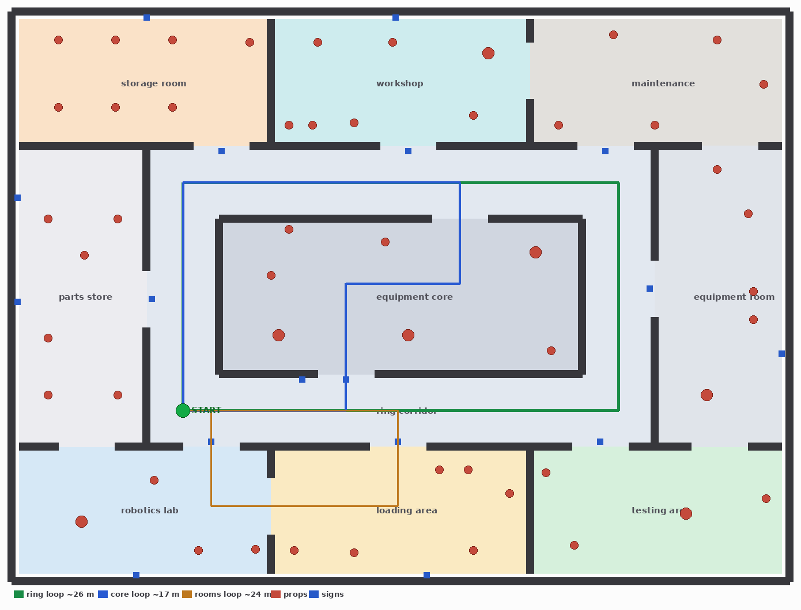

# hexapod_worlds — the hexapod's simulation worlds

A bespoke **industrial robotics facility** (15 × 11 m) built as a test environment for
**RGB-D visual SLAM**, and later for Nav2. It is generated from primitives and
procedural textures, so it loads with no downloads, renders cheaply, and can be
rebuilt from source.

<p align="center">
  <br>
  <em>Plan view: rooms, props (red), signs (blue) and the three test loops.</em>
</p>

## Run it

```bash
./run_facility.sh                 # Gazebo GUI, robot at START on the ring
./run_facility.sh headless:=true  # no GUI (faster; use for measurements)

# in a second terminal, the walking gait
ros2 launch hexapod_gait gait.launch.py
```

## What is in the facility

| Area | What it holds | Why |
|------|---------------|-----|
| Ring corridor | lane-marked epoxy floor, numbered doors D1–D8 | the main 25.6 m loop; kept clear of obstacles |
| Equipment core | CNC machines, press, control panel, pipes | sits **inside** the ring, with a door at each end, so it splits the ring into shorter loops |
| Robotics lab | fenced test cell, bench, control panel, ESD floor | distinctive room, two doors |
| Loading area | pallets, crates, barrels, hazard floor | repeated boxy structure |
| Testing area | test cell, bench, pillar | open floor |
| Storage room | six shelving bays with coloured bins | the most repetitive structure in the world |
| Workshop | benches, press, lockers, oil-stained concrete | |
| Maintenance | low pipe run, control panel, spares, steel plate floor | |
| Parts store | shelving both sides of a narrow aisle | tight space |
| Equipment room | machine, barrels, cable reel | reached from the ring or through testing |

Three nested loops for loop-closure tests: **ring 25.6 m**, **core 19.5 m**,
**rooms 12.0 m**. START is on the ring, inside a loop.

The robot's camera is only **0.14 m** above the floor, so the world puts its detail
low: floor markings, kick plates, door numbers at 0.75 m, pallets, pipe runs and
cable reels. Each zone has its own materials; the two corridor legs are deliberately
similar, to test perceptual aliasing rather than hide it.

## Tools

```bash
ros2 run hexapod_worlds generate_slam_world      # rebuild world, models, textures, map
ros2 run hexapod_worlds validate_slam_world      # geometry: overlaps, reachability, loops
ros2 run hexapod_worlds inspect_facility_views   # what the camera sees, per zone (needs sim)
ros2 run hexapod_worlds drive_facility_loop --loop core   # walk a loop (needs sim + gait)
```

`validate_slam_world` needs no simulator: it rasterises the layout, inflates it by the
robot's radius and checks that props do not overlap walls or each other, that every
room is reachable from START, and that each loop has a walking lane.
`inspect_facility_views` puts a probe camera at robot height in every zone and counts
ORB features, so "the camera has something to track" is measured, not assumed.

## Layout of the package

```text
hexapod_worlds/
├── hexapod_worlds/
│   ├── layout.py         rooms, walls, doors, props, loops  (the structure)
│   ├── textures.py       procedural materials               (the look)
│   ├── generate.py       writes the SDF world, models, map
│   ├── validate.py       geometric checks
│   ├── inspect_views.py  camera-feature checks
│   └── drive_loop.py     waypoint walk of a loop
├── worlds/hexapod_facility.sdf     generated, committed
├── models/                         generated props + shared textures
├── launch/slam_world.launch.py
└── docs/                           plan, clearance map, camera views
```

Structure and style are separate on purpose: change `layout.py` to move rooms,
`textures.py` to restyle, and nothing else needs touching.

## Notes for the simulation

- The ground outside the building is **visual only**. A collision plane there would sit
  exactly under the floor slabs and the feet would chatter between two surfaces.
- All geometry is merged into a few links. Built as one link per box, the same facility
  ran at half the real-time factor.
- Shadows are off and lighting is kept to nine lamps: the budget goes to RGB-D rendering.
